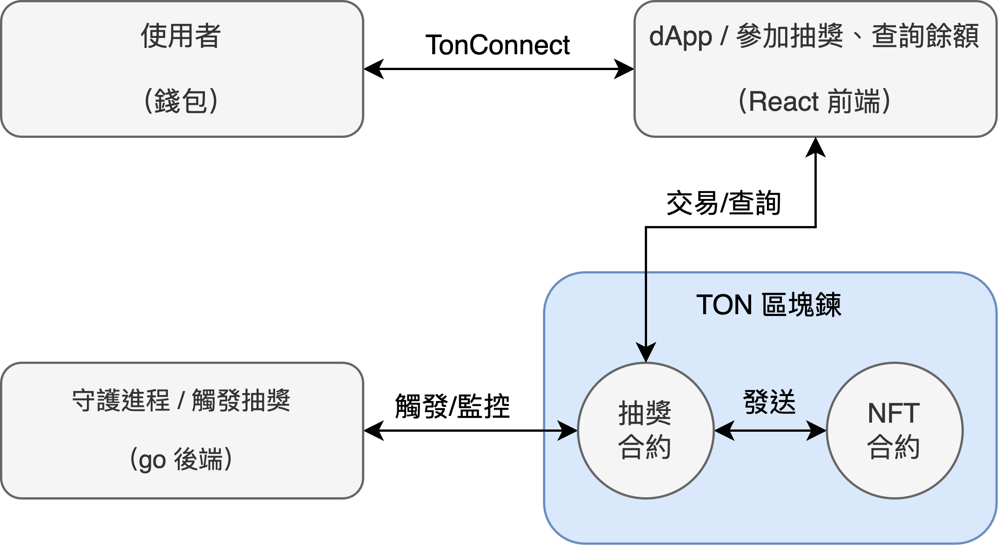

# TON Cat Lottery dApp — 貓咪 NFT 抽獎平台

> 一個基於 TON 區塊鏈的鏈上抽獎系統，參加者可支付少量 TON 參與抽獎，有機會贏得限量版貓咪 NFT。

> 前端使用 React + TonConnect，後端使用 Go 來實作自動抽獎機器人，整體部署採用容器（Docker）化，並透過 terraform 來自動編排 GCP 基礎設施部署和搭配 GitHub Action 完成 CI/CD。

---

## ✨ 專案亮點

- **全鏈上邏輯**：使用 Tact 撰寫智能合約，負責抽獎與 NFT 發送
- **後端自動化抽獎機器人**：Go 撰寫 RPC 調用邏輯，自動觸發中獎邏輯
- **前端與錢包互動**：React + TonConnect，與 TON 錢包整合參與抽獎
- **Docker 容器化**：後端、前端、節點、監控模組皆為獨立容器
- **微服務架構**：各個模組透過 k8s 來實作微服務化
- **完整 DevOps 管線**：Terraform、GitHub Actions CI/CD
- **NFT 合約**：支援隨機發送限量貓咪 NFT，符合 TON NFT 標準

---

## 🖼️ 系統架構圖



---

## 📦 專案目錄結構

```bash
ton-cat-lottery/
├── contracts/                # Tact 智能合約
│   ├── CatLottery.tact       # 主抽獎合約
│   ├── CatNFT.tact           # 貓咪 NFT 合約
│   ├── scripts/              # 部署與互動腳本
│   └── tests/                # 合約測試
├── backend/                  # Go 抽獎機器人服務  
│   ├── main.go
│   ├── internal/             # 核心業務邏輯
│   │   ├── lottery/          # 抽獎邏輯
│   │   ├── wallet/           # 錢包管理
│   │   └── ton/              # TON 客戶端
│   └── pkg/logger/           # 日誌工具
├── frontend/                 # React dApp
│   ├── src/
│   │   ├── components/       # React 組件
│   │   └── services/         # 合約服務
│   └── public/               # 靜態資源
├── docker/                   # 前端/後端容器話設定
├── terraform/                # terraform 基礎設施部署設定
├── .github/workflows/        # CI/CD 配置
├── docker-compose.yml        # Docker 容器編排
└── README.md
```

---

## 🧠 核心功能模組

### 🎯 智能合約（CatLottery.tact）

- 完整合約說明請參考： [NFT 合約文檔](docs/NFTREADME.md)
- 故事說明請參考： [貓咪樂園抽獎故事](docs/NFTStory.md)
- 定義抽獎規則 (3 人滿員抽獎)
- 管理參與者資料 (地址、費用、時間)
- 執行隨機抽獎 (基於區塊鏈隨機性)
- 發送 NFT 給中獎者
- 管理合約狀態 (活躍/非活躍)
- Function:
  ```typescript
  // CatLottery.tact
  join(): 支付 TON 並加入抽獎池
  drawWinner(): 隨機選出中獎者並發送 NFT
  sendNFT(address): 調用 NFT 合約並發送對應貓咪 NFT
  ```

### 🧰 後端自動抽獎機器人（Go）

- 完整後端說明請參考： [後端文檔](docs/BackREADME.md)
- 定時檢查合約狀態 (每 30 分鐘)
- 自動觸發抽獎 (當人數達到 3 人)
- 發送 drawWinner 交易
- 監控交易結果
- 記錄抽獎歷史

### 💻 前端 dApp

- 使用 TonConnect SDK 連接 Tonkeeper 錢包
- 顯示合約狀態 (參與人數、費用、輪次)
- 參與抽獎功能 (發送 join 交易)
- 交易狀態提示 (成功/失敗通知)

---

## ⚙️ DevOps 架構細節

### 容器化架構
- **Docker 說明請參考：** [Docker 文檔](docs/DockerREADME.md)
- **多服務容器編排：** Docker Compose 統一管理前端 React dApp、Go 後端服務、TON 節點，實現本地開發環境一鍵啟動
- **分層鏡像優化：** 前端使用 Nginx Alpine 基底，後端使用 Go Alpine 多階段構建，減少鏡像體積

### 雲端基礎設施
- **GCP 微服務部署：** 使用 GKE Autopilot 自動管理 Kubernetes 叢集，無需手動維護節點
- **Terraform Infrastructure as Code：** 
  ```
  ├── VPC 網路 + 子網路配置
  ├── GKE 叢集 (Autopilot 模式)
  ├── Container Registry 映像倉庫
  ├── 靜態外部 IP + LoadBalancer
  └── IAM 服務帳戶權限管理
  ```
- **服務發現：** Kubernetes Service + Ingress 控制器處理流量路由

### CI/CD 自動化管線
- **GitHub Actions 工作流：**
  ```
  Code Push → Unit Tests → Docker Build → 
  Push to GCR → Deploy to GKE → Health Check
  ```
- **多環境部署策略：** 
  - `main` 分支自動部署到生產環境
  - `develop` 分支部署到測試環境
  - Pull Request 觸發臨時預覽環境

### 監控與可觀測性
- **業務指標監控：** Prometheus 收集 TON 區塊鏈節點狀態、抽獎成功率、NFT 轉移狀態
- **系統監控：** CPU、記憶體、網路、存儲使用率實時追蹤
- **Grafana 視覺化：** 自定義儀表板顯示抽獎活動熱力圖、系統健康度、用戶行為分析
- **告警機制：** 當抽獎失敗率 > 5% 或系統響應時間 > 2s 時自動發送 Slack 通知

### 安全與合規
- **容器安全：** 集成 Trivy 掃描器檢測映像漏洞，阻止高風險映像部署
- **秘密管理：** 使用 Google Secret Manager 存儲私鑰、API Token，避免硬編碼
- **網路安全：** GKE 私有叢集 + VPC 防火牆規則，限制不必要的外部訪問

---

## 🛠️ 環境需求

```
- Node.js >= 22.18.0
- Go >= 1.24.5
- Docker & Docker Compose
- Tact CLI
```

---

## 🧪 測試指令

### 測試智能合約

```bash
cd contracts
npm run test
```

### 測試 Go 後端

```bash
cd backend
./test.sh
```

### 測試前端

```bash
cd frontend
npm run build
```

---

## 🚀 智能合約部署

> 在運行應用之前，需要先部署智能合約到 TON 區塊鏈。

### 部署到測試網

```bash
# 進入合約目錄
cd contracts

# 安裝依賴
npm install

# 部署合約到測試網
npx blueprint run deployCatLottery --testnet --tonconnec
```

### 部署後設定

1. **記錄合約地址**: 部署完成後，將顯示的合約地址記錄下來
2. **更新環境變數**: 在 `.env` 檔案中設定合約地址
   ```bash
   LOTTERY_CONTRACT_ADDRESS=你的抽獎合約地址
   NFT_CONTRACT_ADDRESS=你的NFT合約地址
   ```

#### 部署到主網

```bash
# 部署到主網 (請確保錢包有足夠的 TON)
npx blueprint run deployCatLottery --mainnet --tonconnec
```

⚠️ **注意**: 主網部署需要真實的 TON 代幣作為 gas 費用。

---

## 🚀 快速開始

1. 部署智能合約，請參考：[智能合約部署](#智能合約部署)

2. 新增環境變數

```bash
cp .env.example .env
```

3. 使用 docker compose 啟動所有服務

```bash
docker compose up -d
```

---

## 📈 示意圖（可放到 GitHub）

- dApp 操作畫面截圖:
<!-- Image of dApp -->

- NFT 顯示圖:
<!-- Image of NFT -->

- Grafana 監控圖:
<!-- Image of Grafana -->

---

## 📚 技術棧

| 類別     | 技術                           |
| -------- | ------------------------------ |
| 程式語言 | Typescript, Go, Node.js, React |
| 區塊鏈   | TON, Tact, TonConnect          |
| 後端     | Go, Node.js                    |
| 前端     | React                          |
| 部署     | Docker, GitHub Actions, k8s    |
| 監控     | Prometheus, Grafana            |
| 基礎設施 | Terraform, GCP                 |

---

## 🏁 TODO Checklist - 功能導向模組拆解

> 本清單依照功能模組拆解為可執行任務，便於開發與進度追蹤。

### 智能合約模組（Tact）

> 定義好「抽獎怎麼運作」「怎麼發 NFT」「參與者怎麼加入」。

- [x] 初始化 `CatLottery.tact` 合約結構（定義 join/drawWinner/sendNFT）
- [x] 設計儲存參加者資料的 Cell 結構（儲存地址列表）
- [x] 實作 `join()` 方法（收款 + 儲存參與者）
- [x] 實作 `drawWinner()` 方法（根據 block hash 隨機選取）
- [x] 實作 `sendNFT(address)`：觸發 NFT 合約轉移
- [x] 撰寫單元測試腳本（測試參加、抽獎、轉移邏輯）
- [x] 使用 `tact` CLI 部署至 testnet
- [x] 撰寫 NFT 合約（符合 TON NFT 規範，支援 metadata）
- [x] 鑄造並部署預設的 NFT（貓咪圖像）
- [x] 部署抽獎合約到 TON testnet
- [ ] 部署 NFT 合約到 TON testnet

### 後端服務模組（Go）

> 精簡版後端，專注於核心抽獎功能，減少實作複雜度但保持專案完整性。

- 基礎設施

  - [x] 初始化 Go 專案與模組設定（go.mod, 目錄結構）
  - [x] 基礎配置管理（環境變數、合約地址、私鑰）
  - [x] 基礎日志記錄（可用標準 log 套件）

- 智能合約互動

  - [x] 撰寫 TonCenter API 客戶端（基礎查詢功能）
  - [x] 實作錢包管理與交易簽名
  - [x] 核心抽獎功能：
    - [x] `GetContractInfo()` - 查詢抽獎狀態
    - [x] `SendDrawWinner()` - 執行抽獎
    - [x] `SendStartNewRound()` - 開始新輪次
  - [x] 基礎交易監控（檢查交易是否成功）

- 核心業務邏輯

  - [x] 實作自動抽獎定時器（簡單 cron job 或 ticker）
  - [x] 基礎抽獎流程控制（檢查條件 → 執行抽獎 → 記錄結果）
  - [x] 簡單錯誤處理與重試機制

- 基礎測試

  - [x] 撰寫核心功能單元測試
  - [x] 基礎集成測試（抽獎流程測試）

- 實際測試
  - [ ] 鏈接到監控合約，並進行監控
  - [ ] 鏈接到抽獎合約，並進行抽獎
  - [ ] 鏈接到 NFT 合約，並進行 NFT 發送

### 前端 dApp（React + TonConnect）

> 在智能合約初步穩定後，你可以建立 dApp 前端與錢包互動。

#### 基本功能

- [x] 建立 React 專案架構 (Vite + TypeScript + 基礎 CSS)
- [x] 整合 TonConnect SDK - 支援 Tonkeeper 錢包連接與斷開
- [x] 建立自己的 mainfest 用來做測試，透過 cloudflare pages 來部署
- [x] 顯示合約狀態 - 參與人數、當前輪次、抽獎是否活躍
  - [x] 使用模擬資料來顯示合約狀態
  - [x] 串接真實的合約資料
- [x] 實作參加抽獎功能 - 發送 `join()` 交易並支付參與費用
  - [x] 合約還沒部署完成，所以先使用空 payload 來測試
  - [x] 合約部署完成後，使用 "join" 消息
- [x] 顯示用戶錢包資訊 - 地址、TON 餘額
- [x] 基礎交易狀態提示 - 發送中、成功、失敗通知
- [x] 基礎錯誤處理 - 網路錯誤、餘額不足、抽獎已滿等
- [ ] 參與者列表顯示 - 當前輪次的參與者地址
- [ ] 顯示中獎歷史記錄 - 查詢歷史輪次的中獎者和 NFT

#### 進階功能

- [ ] 實作即時狀態更新 - 定期刷新合約狀態（每 30 秒）
- [ ] 顯示獎池資訊 - 當前合約餘額和預計獎金
- [ ] 基礎響應式設計 - 支援手機和桌面瀏覽

---
### DevOps / 雲端自動化部署

> 階段式 DevOps 實作流程：Docker + Kubernetes + GCP + Terraform + CI/CD + GitHub Actions

| 階段 | 內容                    | 技術                       | 目標       |
| ---- | ----------------------- | -------------------------- | ---------- |
| 1    | 基礎容器化              | Docker + Docker Compose    | 本地環境   |
| 2    | GCP 帳號設定            | GCP Console + 手動設定     | 雲端準備   |
| 3    | Terraform + 基礎 CI/CD  | Terraform + GitHub Actions | 自動化基礎 |
| 4    | 完整 CI/CD Pipeline     | GitHub Actions + Multi-env | 企業級流程 |
| 5    | 進階 DevOps（未來實作） | 完整工具鏈                 | 生產就緒   |

---
#### 階段 1：基礎容器化

**技術棧：Docker + Docker Compose**
**目標：建立容器化設定檔**

- [x] 撰寫 `Dockerfile`（backend）
- [x] 撰寫 `Dockerfile`（frontend）
- [x] 撰寫 `docker-compose.yml` 整合後端 / 前端
- [x] 撰寫 `.env` 檔案與 secret 管理
- [x] 本地 Docker 環境驗證與測試

---
#### 階段 2：GCP 帳號設定

**技術棧：GCP Console + 手動設定**  
**目標：完成無法自動化的帳號層級設定**

- [x] **GCP 帳號與計費設定**（無法自動化的部分）：
  - [x] 註冊 GCP 帳號（新用戶可獲得 $300 免費額度）
  - [x] 建立專案 `ton-cat-lottery-dev`
  - [x] 設定計費帳戶與預算告警（$50/月 開發限制）
  
- [x] **本地開發工具安裝：**
  - [x] 安裝 Google Cloud SDK：`brew install --cask gcloud-cli`
  - [x] 安裝 Terraform：`brew install terraform`
  - [x] 安裝 kubectl：`gcloud components install kubectl`
  - [x] 設定認證：`gcloud auth login`
  - [x] 檢查專案列表：`gcloud projects list`
  - [x] 設定專案：`gcloud config set project {PROJECT_NAME}`
  
- [x] **Terraform 服務帳戶設定：**
  - [x] 建立 Terraform 服務帳戶
  - [x] 分配 Terraform 服務帳戶必要權限：
    - Project Editor
    - Kubernetes Engine Admin  
    - Service Account Admin
  - [x] 下載服務帳戶金鑰 JSON 檔案
  - [x] **驗證**：測試 `gcloud auth activate-service-account` 正常運作

---
#### 階段 3：基礎自動化部署

**技術棧：Terraform + GitHub Actions + GKE**  
**目標：用 Infrastructure as Code 建立完整雲端環境**

##### **Terraform 基礎設施即代碼：**

- [x] 建立 `terraform/` 目錄結構

- [x] **GCP API 啟用 Checklist：**
  > 需要啟用的服務許可
  1. **計算與容器服務**
      ```
      container.googleapis.com        # Kubernetes Engine API (GKE)
      compute.googleapis.com          # Compute Engine API (VPC, 防火牆, IP)
      ```
  2. **容器映像儲存**
      ```
      containerregistry.googleapis.com  # Container Registry API (傳統)
      artifactregistry.googleapis.com   # Artifact Registry API (新版，推薦)
      ```
  3. **CI/CD 與建構**
      ```
      cloudbuild.googleapis.com         # Cloud Build API (自動建構)
      ```
  4. **權限與安全**
      ```
      iam.googleapis.com                 # Identity and Access Management API
      cloudresourcemanager.googleapis.com # Resource Manager API (專案管理)
      ```
  5. **網路服務**
      ```
      servicenetworking.googleapis.com   # Service Networking API (VPC 連接)
      dns.googleapis.com                 # Cloud DNS API (如果使用 Cloud DNS)
      ```

- [x] **Terraform 資源建立 Checklist：**
  > 實際要建立的雲端資源

  |         Terraform Resource         |     內容     |
  | ---------------------------------- | ------------ |
  | google_project_service             | API 啟用 |
  | google_container_cluster           | GKE Autopilot 叢集 |
  | google_compute_network             | VPC 網路 |
  | google_compute_subnetwork          | 子網路 |
  | google_compute_firewall            | 防火牆規則 |
  | google_container_registry          | Container Registry（或 Artifact Registry） |
  | google_compute_address             | 靜態外部 IP（LoadBalancer 用） |
  | google_project_iam_member          | IAM 權限設定 |
  | google_service_account             | GKE 節點服務帳戶 |

- [x] **創建主要配置檔案：**
  - [x] `main.tf` - 主要資源定義
  - [x] `variables.tf` - 變數定義
  - [x] `outputs.tf` - 輸出值（叢集端點、IP 等）
  - [x] `versions.tf` - Provider 版本鎖定
  - [x] `terraform.tfvars` - 實際變數值
    - [x] 先建立 `terraform.tfvars.example`
    - [x] 再 `cp terraform.tfvars.example terraform.tfvars`
    - [x] 最後，把 GCP Project ID 填入 `terraform.tfvars`

- [x] **測試 Terraform 流程：**
  - [x] `terraform init` - 初始化
  - [x] `terraform plan` - 檢查部署計畫
  - [x] `terraform apply` - 執行部署
  - [x] **驗證**：確保 Terraform 可以完整建立/刪除 GKE 環境
  - [x] 最後整理 terraform 的 `.gitignore`

##### **K8s 應用部署準備（手動驗證一次）：**

- [x] **準備階段：**
  - [x] 確認 Terraform 基礎設施已部署完成
  - [x] 驗證 GKE Autopilot 叢集狀態：`kubectl get nodes`
  - [x] 確認 Artifact Registry 已創建並可訪問

- [ ] **建構與推送容器映像：**
  - [x] 配置 Docker 認證：`gcloud auth configure-docker asia-east1-docker.pkg.dev`
  - [x] **重要**：設定 Docker buildx 多架構支援：`docker buildx create --use --name multiarch`
  - [x] 建構 backend Docker Image (x86_64)：`docker buildx build --platform linux/amd64 -f docker/Dockerfile.backend -t asia-east1-docker.pkg.dev/PROJECT_ID/ton-cat-lottery/backend:$(git rev-parse --short HEAD) -t asia-east1-docker.pkg.dev/PROJECT_ID/ton-cat-lottery/backend:latest --push .`
  - [x] 建構 frontend Docker Image (x86_64)：`docker buildx build --platform linux/amd64 -f docker/Dockerfile.frontend --target production -t asia-east1-docker.pkg.dev/PROJECT_ID/ton-cat-lottery/frontend:$(git rev-parse --short HEAD) -t asia-east1-docker.pkg.dev/PROJECT_ID/ton-cat-lottery/frontend:latest --push .`
  - [x] **驗證映像**：確認映像架構正確：`docker manifest inspect asia-east1-docker.pkg.dev/PROJECT_ID/ton-cat-lottery/backend:latest`

- [x] **構建 K8s 部署檔案：**
  - [x] 組織 `k8s/` 目錄結構（backend/, frontend/, ingress/）
  - [x] 創建 ConfigMap 管理環境變數（backend-config.yaml, frontend-config.yaml）
  - [x] 創建 Secret 管理敏感資訊（backend-secrets.yaml）
  - [x] 優化 backend Deployment YAML（資源限制、健康檢查、標籤策略）
  - [x] 優化 frontend Deployment YAML（資源限制、健康檢查、標籤策略）
  - [x] 重寫 backend Service YAML（ClusterIP，因為不需要外部訪問）
  - [x] 重寫 frontend Service YAML（ClusterIP）
  - [x] 創建 Ingress YAML 替代 LoadBalancer（支援 HTTPS、域名）
  - [x] 添加 NetworkPolicy YAML（網路安全隔離）

- [x] **安全性和生產準備：**
  - [x] 移除硬編碼的測試值，使用 Secret 和 ConfigMap
  - [x] 配置適當的資源請求和限制
  - [x] 添加 Pod Security Context（非 root 用戶）
  - [x] 配置 Horizontal Pod Autoscaler (HPA)
  - [x] 設定適當的 labels 和 annotations

- [x] **手動測試一次完整部署流程：**
  - [x] 取得 GKE 叢集憑證：`gcloud container clusters get-credentials ton-cat-lottery-cluster --region asia-east1`
  - [x] 創建命名空間：`kubectl create namespace ton-cat-lottery`
  - [x] 部署 ConfigMaps 和 Secrets：`kubectl apply -f k8s/config/`
  - [x] 手動部署 backend：`kubectl apply -f k8s/backend/`
  - [x] 手動部署 frontend：`kubectl apply -f k8s/frontend/`
  - [x] 部署 Ingress：`kubectl apply -f k8s/ingress/`

- [x] **驗證應用：**
  - [x] 檢查所有 Pod 狀態為 Running：`kubectl get pods -n ton-cat-lottery`
  - [x] 檢查 Service 正常工作：`kubectl get svc -n ton-cat-lottery`
  - [x] 檢查 Ingress 取得外部 IP：`kubectl get ingress -n ton-cat-lottery`
  - [x] 測試內部服務連通性：`kubectl exec -it POD_NAME -- curl backend-service`
  - [x] 驗證應用可以透過 Ingress IP 訪問
  - [x] 測試 HTTPS 證書自動配置
  - [x] 檢查日誌和監控指標
  - [x] 測試 Pod 自動重啟和擴縮容
  - [x] 驗證網路策略生效（如有配置）

- [x] **效能和監控驗證：**
  - [x] 配置 Google Cloud Monitoring 集成
  - [x] 設定日誌收集和查詢
  - [x] 測試應用在負載下的表現
  - [x] 驗證 HPA 自動擴縮容功能

- [x] 更新 k8s 相關的內容到 `.gitignore`
- [x] 整理內容到 `DevOpsREADME.md` 中

##### **GitHub Actions CI/CD：**

###### **基礎流程 (必要)：基本 DevOps**

- [x] **準備階段：**
  - [x] 建立 `.github/workflows/` 目錄結構
  - [x] 建立 `.github/` 相關的 `.gitignore` 規則
  - [x] 準備工作流程模板檔案

- [x] **基礎 CI 工作流程 (`ci.yml`)：**
  - [x] **核心代碼品質檢查：**
    - [x] 智能合約測試：`cd contracts && npm run test`
    - [x] 前端建構測試：`cd frontend && npm run build`
    - [x] Go 後端測試：`cd backend && ./test.sh`
  
  - [x] **基礎 Docker 建構：**
    - [x] 建構 backend Docker 映像
    - [x] 建構 frontend Docker 映像
    - [x] 驗證映像建構成功

- [x] **基礎 CD 工作流程 (`cd.yml`)：**
  - [x] **簡單觸發條件：**
    - [x] 手動觸發部署選項 (workflow_dispatch)
    - [x] `main` 分支推送自動部署
  
  - [x] **映像推送到 Artifact Registry：**
    - [x] 配置 GCP 認證：使用 `google-github-actions/auth@v2`
    - [x] 配置 Docker 認證：`gcloud auth configure-docker`
    - [x] 推送 backend 映像：基礎標籤策略 (latest, git-sha)
    - [x] 推送 frontend 映像：基礎標籤策略 (latest, git-sha)
    - [x] **驗證映像推送成功**：檢查 Artifact Registry
  
  - [x] **基礎 GKE 部署：**
    - [x] 取得 GKE 憑證：`gcloud container clusters get-credentials`
    - [x] 執行滾動更新：`kubectl set image deployment/backend`
    - [x] 執行滾動更新：`kubectl set image deployment/frontend`
    - [x] **等待部署完成**：`kubectl rollout status`
  
  - [x] **基礎部署驗證：**
    - [x] 健康檢查：驗證所有 Pod 為 Running 狀態
    - [x] 服務連通性測試：內部服務通信檢查

- [x] **GitHub Secrets 配置：**
  - [x] `GCP_SA_KEY`：Terraform 服務帳戶的 JSON 金鑰
  - [x] `GCP_PROJECT_ID`：GCP 專案 ID
  
###### **進階流程 (可選)：企業級 DevOps 特性**

- [ ] **進階 CI 功能：**
  - [ ] 多 Node.js 版本矩陣測試 (18.x, 20.x, 22.x)
  - [ ] 前端 Lint 檢查：`npm run lint`
  - [ ] Go 後端 Lint 檢查：`golangci-lint run`
  - [ ] 安全性掃描：Trivy 容器映像漏洞掃描
  - [ ] 依賴安全掃描：npm audit, govulncheck
  - [ ] 映像大小優化檢查
  - [ ] 容器功能性測試

- [ ] **進階 CD 功能：**
  - [ ] 多環境部署策略 (develop→開發環境, main→生產環境)
  - [ ] 版本標籤 (git tag) 觸發穩定版部署
  - [ ] 動態環境配置 (ConfigMap/Secret 管理)
  - [ ] 外部訪問測試：通過 Ingress 訪問應用
  - [ ] 煙霧測試：基礎功能驗證 (API 端點檢查)
  - [ ] **自動回滾機制**：`kubectl rollout undo deployment/SERVICE`

- [ ] **企業級監控與通知：**
  - [ ] GitHub Environment Protection (生產環境手動審批)
  - [ ] 部署成功/失敗通知機制
  - [ ] 集成執行時間監控
  - [ ] 部署頻率和成功率統計

- [ ] **額外應用程式 Secrets (按需設定)：**
  - [ ] `LOTTERY_CONTRACT_ADDRESS`：智能合約地址
  - [ ] `NFT_CONTRACT_ADDRESS`：NFT 合約地址
  - [ ] `WALLET_PRIVATE_KEY`：後端錢包私鑰
  - [ ] `TON_NETWORK`：TON 網路環境

- [ ] **工作流程進階配置：**
  - [ ] **條件部署策略：**
    - [ ] 只有在 CI 通過時才執行 CD
    - [ ] 生產環境部署需要手動審批 (GitHub Environment Protection)
    - [ ] 設定部署時間窗口 (避免高峰期部署)
  
  - [ ] **通知機制：**
    - [ ] 部署成功/失敗 Slack 通知
    - [ ] 郵件通知關鍵人員
    - [ ] GitHub Issue 自動創建 (部署失敗時)
  
  - [ ] **監控與可觀測性：**
    - [ ] 集成 GitHub Actions 執行時間監控
    - [ ] 部署頻率和成功率統計
    - [ ] 建構時間趨勢分析

- [ ] **測試完整 CI/CD 流程：**
  - [ ] **CI 流程測試：**
    - [ ] 提交代碼變更觸發 CI 工作流程
    - [ ] **驗證所有檢查通過**：
      - [ ] 代碼品質檢查無誤
      - [ ] 所有測試用例通過
      - [ ] 安全掃描無高風險問題
      - [ ] Docker 映像建構成功
  
  - [ ] **CD 流程測試：**
    - [ ] 合併到 `main` 分支觸發 CD 工作流程
    - [ ] **驗證自動部署流程**：
      - [ ] 映像自動推送到 Artifact Registry
      - [ ] GKE 叢集自動更新應用
      - [ ] 健康檢查通過
      - [ ] 應用透過域名正常訪問
  
  - [ ] **失敗情況測試：**
    - [ ] 測試建構失敗時的工作流程中斷
    - [ ] 測試部署失敗時的自動回滾機制
    - [ ] 驗證失敗通知機制正常運作

- [ ] **文件與最佳實踐：**
  - [ ] 更新 `.gitignore`：添加 GitHub Actions 相關忽略規則
  - [ ] 更新 CI/CD 的說明到 `docs/DevOpsREADME.md` 中，包含簡介、檔案結構、指令、故障排除
  - [ ] 建立 CI/CD Badge：顯示建構和部署狀態
  - [ ] **驗證文件完整性**：確保新成員可以根據文件獨立操作

##### **域名與外部訪問設定：**

- [ ] **設定 LoadBalancer：**
  - [ ] 確認 Terraform 已建立靜態 IP
  - [ ] 設定 K8s LoadBalancer Service 使用靜態 IP
  - [ ] **驗證 LoadBalancer**：取得正確的外部 IP

- [ ] **Cloudflare DNS 設定：**
  - [ ] 取得 LoadBalancer 外部 IP：`terraform output external_ip`
  - [ ] 在 Cloudflare 設定 A record 指向外部 IP
  - [ ] **驗證域名訪問**：確保應用可透過域名正常訪問

---
#### 階段 4：進階多環境部署 (未來擴展)

**技術棧：GitHub Actions + Multi-environment**  
**目標：企業級多環境自動化**

- [ ] **多環境 Terraform 配置：**
  - [ ] 建立 dev/staging/prod 環境變數檔案
  - [ ] 配置不同環境的 GKE 叢集規格
  - [ ] 設置環境隔離的網路配置

- [ ] **GitHub Actions 進階工作流程：**
  - [ ] Pull Request 自動測試和預覽部署
  - [ ] 分支策略：dev → staging → prod
  - [ ] 手動審批生產環境部署
  - [ ] 配置環境保護規則和通知

---
#### 階段 5：進階監控與安全 (未來擴展)

**目標：生產就緒的完整 DevOps**

- [ ] **監控系統：**
  - [ ] Prometheus + Grafana 監控
  - [ ] 自定義指標和告警
  - [ ] 日誌聚合和分析

- [ ] **安全強化：**
  - [ ] 容器安全掃描
  - [ ] 秘密管理優化 (Google Secret Manager)
  - [ ] 網路安全策略和 WAF

- [ ] **成本優化：**
  - [ ] 資源使用監控
  - [ ] GKE 自動縮放策略
  - [ ] 成本告警和優化建議

---
### 測試與驗證

> 確保各模組運作正常，並驗證整體流程。

- [ ] 單元測試（Go 抽獎邏輯）
- [ ] 合約模擬測試（join/draw/sendNFT）
- [ ] 前端交易模擬測試（使用測試錢包）
- [ ] 整合測試：參加 ➜ 抽獎 ➜ NFT 發送 ➜ 前端顯示
- [ ] 多用戶壓力測試（使用 Locust 或腳本）

---
### 文件與展示

- [ ] 完善 `README.md`（專案簡介、啟動指南、技術棧）
- [ ] 撰寫部署教學文件（含 VPS、Docker、CI/CD）
- [ ] 製作操作畫面截圖與影片 demo
- [ ] 撰寫使用說明與常見問題 FAQ
- [ ] 製作開源版本發佈（版本化管理）
