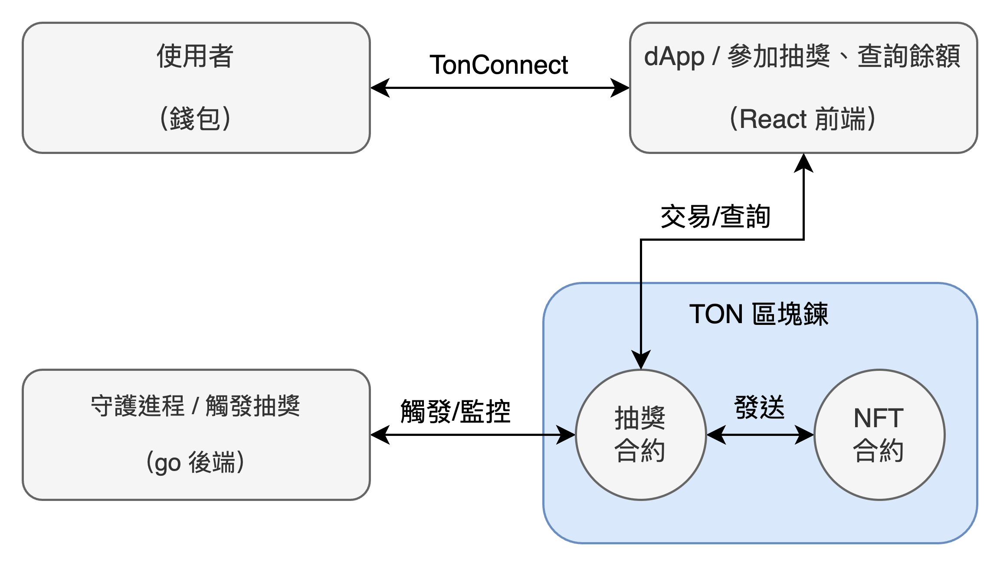
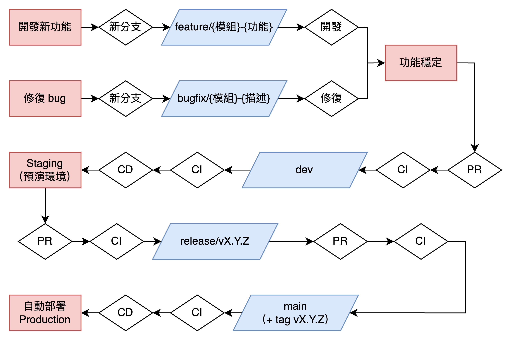
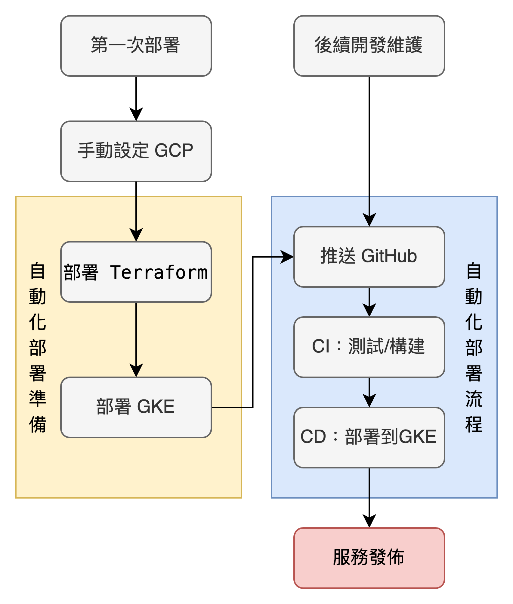

# TON Cat Lottery dApp — 貓咪 NFT 抽獎平台

> 一個基於 TON 區塊鏈的鏈上抽獎系統，參加者可支付少量 TON 參與抽獎，有機會贏得限量版貓咪 NFT。

> 前端使用 React + TonConnect，後端使用 Go 來實作自動抽獎機器人，整體部署採用容器（Docker）化，並透過 terraform 來自動編排 GCP 基礎設施部署和搭配 GitHub Action 完成 CI/CD。

---

## ✨ 專案亮點

- **全鏈上邏輯**：使用 Tact 撰寫智能合約，負責抽獎與 NFT 發送
- **後端自動化抽獎機器人**：Go 撰寫 RPC 調用邏輯，自動觸發中獎邏輯
- **前端與錢包互動**：React + TonConnect，與 TON 錢包整合參與抽獎
- **Docker 容器化**：後端、前端、節點、監控模組皆為獨立容器
- **微服務架構**：各個模組透過 k8s 來實作微服務化
- **完整 DevOps 管線**：Terraform、GitHub Actions CI/CD

---

## 🖼️ 系統架構圖


---
## 🛠️ 開發工具
- 透過 ChatGPT 來瞭解 DevOps 所需的技術鍊
- 閱讀各個工具的文檔來瞭解詳細技術：
  - **區塊鍊**：https://www.geeksforgeeks.org/software-engineering/blockchain/
  - **Ton**：https://docs.ton.org/v3/documentation/ton-documentation
  - **Terraform**：https://developer.hashicorp.com/terraform/docs
  - **k8s**：https://kubernetes.io/docs/home/
  - **cert-manager**：https://cert-manager.io/docs/
  - **GitHub Action**：https://docs.github.com/en/actions/get-started/understand-github-actions
- 開發過程透過 **cursor** 和 **Claude Code** 來協助開發
---
- 開發流程：
  

---
- 部署流程：
  


---

## 📦 專案目錄結構

```bash
ton-cat-lottery/
├── contracts/                # Tact 智能合約
│   ├── CatLottery.tact       # 主抽獎合約
│   ├── CatNFT.tact           # 貓咪 NFT 合約
│   ├── scripts/              # 部署與互動腳本
├── backend/                  # Go 抽獎機器人服務  
├── frontend/                 # React dApp
├── docker/                   # 前端/後端容器話設定
├── terraform/                # terraform 基礎設施部署設定
├── k8s/                      # 微服務設定
├── .github/workflows/        # CI/CD 配置
├── docker-compose.yml        # Docker 容器編排
└── README.md
```

---

## 🧠 核心功能模組

### 🎯 智能合約（CatLottery.tact）

[NFT 合約文檔](docs/NFTREADME.md)

[貓咪樂園抽獎故事](docs/NFTStory.md)


### 🧰 後端自動抽獎機器人（Go）

（尚未完成）
<!-- [後端文檔](docs/BackREADME.md) -->


### ⚙️ DevOps 架構細節

[DevOps文檔](docs/DevOpsREADME.md)

---

## 🛠️ 環境需求

```
- Node.js >= 22.18.0
- Go >= 1.24.5
- Docker & Docker Compose
- Tact CLI
```

---

## 🚀 智能合約部署

> 在運行應用之前，需要先部署智能合約到 TON 區塊鏈。

### 部署到測試網

```bash
# 進入合約目錄
cd contracts

# 安裝依賴
npm install

# 部署合約到測試網
npx blueprint run deployCatLottery --testnet --tonconnec
```

### 部署後設定

1. **記錄合約地址**: 部署完成後，將顯示的合約地址記錄下來
2. **更新環境變數**: 在 `.env` 檔案中設定合約地址
   ```bash
   LOTTERY_CONTRACT_ADDRESS=你的抽獎合約地址
   NFT_CONTRACT_ADDRESS=你的NFT合約地址
   ```

#### 部署到主網

```bash
# 部署到主網 (請確保錢包有足夠的 TON)
npx blueprint run deployCatLottery --mainnet --tonconnec
```

⚠️ **注意**: 主網部署需要真實的 TON 代幣作為 gas 費用。

---


## 📚 技術棧

| 類別     | 技術                           |
| -------- | ------------------------------ |
| 程式語言 | Typescript, Go, Node.js, React |
| 區塊鏈   | TON, Tact, TonConnect          |
| 後端     | Go, Node.js                    |
| 前端     | React                          |
| 部署     | Docker, GitHub Actions, k8s    |
| 基礎設施 | Terraform, GCP                 |
| 監控觀測 | Prometheus, Grafana, Alertmanager |

---

## 🏁 TODO Checklist - 功能導向模組拆解

> 本清單依照功能模組拆解為可執行任務，便於開發與進度追蹤。

- [ ] 智能合約模組: 需要環境特定的合約部署策略
- [ ] 後端模組: 需要環境變數和配置管理
- [ ] 前端模組: 需要環境特定的構建配置
- [ ] DevOps模組: 需要重新設計Terraform和K8s配置
- [ ] CI/CD模組: 需要多環境部署流程

---
### 智能合約模組（Tact）

> 定義好「抽獎怎麼運作」「怎麼發 NFT」「參與者怎麼加入」。

#### 設計合約和 NFT 相關的邏輯
- [x] 抽獎合約如何定義
- [x] NFT 合約如何定義
- [x] 檢查兩者的邏輯和整合方案

#### 開發
##### 抽獎合約
- [x] 初始化 `CatLottery.tact` 合約結構（定義 join/drawWinner/sendNFT）
- [x] 設計儲存參加者資料的 Cell 結構（儲存地址列表）
- [x] 實作 `join()` 方法（收款 + 儲存參與者）
- [x] 實作 `drawWinner()` 方法（隨機選取中獎者，待整合自動發送 NFT）
- [x] 實作 `sendNFT()` 方法（內建 NFT 發送邏輯，需NFT合約支持）
- [x] 實作 `withdraw()` 方法（提取合約餘額，僅擁有者可調用）
- [x] 實作 `SetNFTContract` 消息處理（設定 NFT 合約地址）
- [x] 實作 `getCatNameByTemplate()` 輔助方法（根據模板 ID 獲取貓咪名稱）
- [x] 設計事件系統（ParticipantJoined, LotteryFull, WinnerDrawn, NFTSent，需完整整合測試）
- [x] 新增 NewRoundStarted 事件（提供更好的狀態監控）
- [x] 實作合約狀態管理（lotteryActive、participantCount、currentRound）
- [x] 實作 `startNewRound()` 方法（重置狀態並開始新輪次）
- [x] 實作合約自動重置機制（drawWinner 後自動清理狀態）
- [x] 實作查詢方法（getContractInfo, getParticipant, getWinner, getBalance）

##### NFT 合約
- [x] 撰寫 `CatNFT.tact` 合約（符合 TON NFT 規範）
- [x] 實作 `MintTo(address)` 方法（接收來自 CatLottery 的鑄造請求）
- [x] 實作 `NFTTransfer()` 方法（完整的 NFT 轉移功能）
- [x] 實作 `SetAuthorizedMinter()` 方法（設定授權鑄造者）
- [x] 設計 4 種稀有度貓咪 NFT（Common, Rare, Epic, Legendary）
- [x] 實作 NFT metadata 和貓咪屬性系統  
- [x] 實作 `determineRarity()` 機率系統（Common 60%, Rare 25%, Epic 10%, Legendary 5%）
- [x] 實作 `initializeCatTemplates()` 方法（初始化 4 種貓咪模板）
- [x] 設定 NFT 合約與抽獎合約的授權機制
- [x] 實作查詢方法（getNFT, balanceOf, getCatTemplate, getContractInfo, getAllCatTemplates）
- [x] 實作 NFT 事件系統（NFTMinted, NFTTransferred）

##### 部署和測試腳本
- [x] 撰寫 `deployCatLottery.ts` 部署腳本（包含合約驗證和資訊記錄）
- [x] 撰寫 `deployCatNFT.ts` 部署腳本（包含貓咪模板驗證）
- [x] 撰寫 `integrationTest.ts` 整合測試腳本（完整抽獎流程自動化測試）
- [x] 撰寫 `testNFTContract.ts` NFT 合約邏輯驗證腳本

##### 配置文件
- [x] 更新 `tact.config.json` 支援雙合約編譯
- [x] 確保合約編譯配置正確（debug 模式、external 設定）

##### 文檔更新
- [x] 完整更新 `docs/ContractREADME.md` 
  - [x] 添加完整檔案結構和函數列表
  - [x] 更新項目概覽包含所有已實作功能
  - [x] 添加 NFT 稀有度系統詳細說明
  - [x] 添加技術特色（安全特性、高可用性、Gas 優化）
  - [x] 添加快速開始指南和部署資訊
  - [x] 添加故障排除指南

#### 測試

##### 單元測試
- [ ] **CatLottery 合約單元測試**
  - [ ] `join()` 方法測試 - 參與驗證、費用檢查、參與者記錄
  - [ ] `drawWinner()` 方法測試 - 隨機數生成、中獎者選擇、NFT ID 生成
  - [ ] `sendNFT()` 方法測試 - NFT 發送邏輯、Gas 費用處理
  - [ ] `startNewRound()` 方法測試 - 狀態重置、輪次遞增
  - [ ] `withdraw()` 方法測試 - 餘額提取、權限驗證
  - [ ] 查詢函數測試 - getContractInfo, getParticipant, getWinner, getBalance

- [ ] **CatNFT 合約單元測試**
  - [ ] `MintTo()` 方法測試 - NFT 鑄造、授權驗證、metadata 生成
  - [ ] `NFTTransfer()` 方法測試 - 所有權轉移、ownership tracking
  - [ ] `determineRarity()` 方法測試 - 稀有度機率分佈驗證
  - [ ] `initializeCatTemplates()` 方法測試 - 4 種貓咪模板初始化
  - [ ] 查詢函數測試 - getNFT, balanceOf, getCatTemplate, getContractInfo

##### 整合測試
- [ ] **合約間互動測試**
  - [ ] 抽獎 + NFT 合約授權機制測試
  - [ ] 端到端抽獎流程測試（join → drawWinner → 自動 NFT 發送）
  - [ ] SetNFTContract 和 SetAuthorizedMinter 配置測試

##### 事件系統測試
- [ ] **事件發送與監聽測試**
  - [ ] ParticipantJoined 事件測試
  - [ ] LotteryFull 事件測試
  - [ ] WinnerDrawn 事件測試
  - [ ] NFTSent 事件測試
  - [ ] NewRoundStarted 事件測試
  - [ ] NFTMinted 事件測試
  - [ ] NFTTransferred 事件測試

##### 邊界條件與錯誤處理測試
- [ ] **輸入驗證測試**
  - [ ] 餘額不足測試（參與費用不夠）
  - [ ] 重複參與測試（同一地址重複 join）
  - [ ] 達到最大參與人數測試
  - [ ] 無參與者狀態下抽獎測試

- [ ] **狀態管理測試**
  - [ ] 抽獎非活躍狀態下參與測試
  - [ ] 輪次狀態正確性測試
  - [ ] 參與者計數準確性測試
  - [ ] 狀態重置完整性測試

##### 安全性測試
- [ ] **權限控制測試**
  - [ ] 非擁有者調用 drawWinner 測試
  - [ ] 非擁有者調用 startNewRound 測試
  - [ ] 非擁有者調用 withdraw 測試
  - [ ] 非授權地址調用 MintTo 測試

- [ ] **重入攻擊防護測試**
  - [ ] sendNFT 重入攻擊測試
  - [ ] NFT 鑄造重入攻擊測試

##### Gas 優化與效能測試
- [ ] **Gas 消耗測試**
  - [ ] join 方法 Gas 消耗測試
  - [ ] drawWinner 方法 Gas 消耗測試
  - [ ] NFT 鑄造 Gas 消耗測試
  - [ ] 大批量操作效能測試

##### 稀有度系統測試
- [ ] **NFT 稀有度分佈測試**
  - [ ] Common (60%) 機率驗證測試
  - [ ] Rare (25%) 機率驗證測試  
  - [ ] Epic (10%) 機率驗證測試
  - [ ] Legendary (5%) 機率驗證測試
  - [ ] 大樣本稀有度分佈統計測試

##### 壓力與負載測試
- [ ] **系統極限測試**
  - [ ] 連續多輪抽獎測試
  - [ ] 大量參與者壓力測試
  - [ ] 長期運行穩定性測試


#### 部署
- [x] 部署抽獎合約到 TON testnet
- [x] 部署 NFT 合約到 TON testnet（地址：kQAGSpk8Heq1xkTAL3q1DfxuSFGopYm6xXgNPN9Yexe0JTK7）
- [ ] 設定合約間整合（CatLottery 指向 CatNFT 地址）
- [x] 基礎部署後驗證
  - [x] 合約地址記錄和備份（已記錄在 docs/ContractREADME.md）
  - [ ] 合約功能驗證測試（完整抽獎流程）
  - [x] 更新環境配置檔案（deployments/ 目錄自動生成部署資訊）


---
### 後端服務模組（Go）

> 基於 Go 的智能抽獎守護進程，專注於自動化監聽和管理 TON 區塊鏈上的貓咪 NFT 抽獎系統。後端作為獨立的守護進程服務，24/7 持續運行，不提供對外 API，專職監聽合約狀態並執行自動化任務。

**🎯 推薦實作順序：基礎設施 → 合約互動 → 事件監聽 → 自動化流程 → 基礎測試**

#### 設計模組
- [x] 守護進程架構設計（監聽合約狀態並自動執行抽獎）
- [x] 雙重監聽策略（事件監聽 + 定時輪詢保底機制）
- [x] 自動化流程設計（達 3 人自動抽獎，抽獎完成自動開始新輪次）

#### 撰寫邏輯代碼
- [ ] 基礎設施
  - [ ] 初始化 Go 專案與模組設定（go.mod, 目錄結構）
  - [ ] 基礎配置管理（環境變數、合約地址、私鑰）
  - [ ] 基礎日志記錄（標準 log 套件）

- [ ] 智能合約互動
  - [ ] 撰寫 TonCenter API 客戶端（基礎查詢功能）
  - [ ] 實作錢包管理與交易簽名  
  - [ ] 核心抽獎功能：
    - [ ] `GetContractInfo()` - 查詢抽獎狀態
    - [ ] `SendDrawWinner()` - 執行抽獎
    - [ ] `SendStartNewRound()` - 開始新輪次
  - [ ] 基礎交易監控（檢查交易是否成功）
  - [ ] 簡單重試機制（固定間隔重試，最多3次）

- [ ] 事件監聽系統
  - [ ] 實作 WebSocket 事件監聽器（監聽 LotteryFull 事件）
  - [ ] 實作定時輪詢檢查器（每 30 秒檢查合約狀態）
  - [ ] 雙重監聽策略整合（事件 + 輪詢保底）

- [ ] 自動化流程控制
  - [ ] 自動抽獎觸發器（監聽到 LotteryFull 事件自動執行 drawWinner）
  - [ ] 自動輪次管理器（監聽到 WinnerDrawn 事件自動執行 startNewRound）
  - [ ] 基礎交易狀態監控與重試


#### 測試
- [ ] 基礎測試
  - [ ] 撰寫核心功能 unit test
  - [ ] 基礎 Mock 測試
    - [ ] 使用 Mock TON 客戶端進行離線測試
    - [ ] 模擬基礎異常情況（網路中斷、交易失敗）

- [ ] 容器化與測試
  - [ ] 完善 `Dockerfile.backend`
  - [ ] 測試 Dockerfile

- [ ] 基礎功能測試
  - [ ] 合約監聽測試（驗證事件監聽和輪詢檢查功能）
  - [ ] 自動抽獎測試（驗證 drawWinner 自動觸發）
  - [ ] 自動輪次管理測試（驗證 startNewRound 自動執行）

- [ ] 基礎集成測試
  - [ ] 完整生命週期測試（join → LotteryFull 事件 → 自動 drawWinner → WinnerDrawn 事件 → 自動 startNewRound）


#### 部署
- [ ] 基礎環境配置
  - [ ] 配置測試網環境變數（合約地址、私鑰、API 端點）
  - [ ] 配置基礎監聽參數（事件監聽間隔、重試次數、超時設定）
  - [ ] 配置日誌記錄級別和輸出格式

- [ ] 基礎部署
  - [ ] Docker 容器化部署
  - [ ] 與智能合約連接驗證

- [ ] 基礎運行驗證
  - [ ] 服務啟動和狀態檢查
  - [ ] 事件監聽功能驗證
  - [ ] 完整自動化流程端到端測試


---
### 前端 dApp（React + TonConnect）

> 在智能合約初步穩定後，你可以建立 dApp 前端與錢包互動。

#### 設計客戶端界面和模組架構
- [x] 設計界面
- [x] 定義需要哪些 components

#### 開發
##### 基本功能

- [x] 建立 React 專案架構 (Vite + TypeScript + 基礎 CSS)
- [x] 整合 TonConnect SDK - 支援 Tonkeeper 錢包連接與斷開
- [x] 建立自己的 mainfest 用來做測試，透過 cloudflare pages 來部署
- [x] 顯示合約狀態 - 參與人數、當前輪次、抽獎是否活躍
  - [x] 使用模擬資料來顯示合約狀態
  - [x] 串接真實的合約資料
- [x] 實作參加抽獎功能 - 發送 `join()` 交易並支付參與費用
  - [x] 合約還沒部署完成，所以先使用空 payload 來測試
  - [x] 合約部署完成後，使用 "join" 消息
- [x] 顯示用戶錢包資訊 - 地址、TON 餘額
- [x] 基礎交易狀態提示 - 發送中、成功、失敗通知
- [x] 基礎錯誤處理 - 網路錯誤、餘額不足、抽獎已滿等
- [ ] 參與者列表顯示 - 當前輪次的參與者地址
- [ ] 顯示中獎歷史記錄 - 查詢歷史輪次的中獎者和 NFT

##### 進階功能

- [ ] 實作即時狀態更新 - 定期刷新合約狀態（每 30 秒）
- [ ] 顯示獎池資訊 - 當前合約餘額和預計獎金
- [ ] 基礎響應式設計 - 支援手機和桌面瀏覽

#### 測試
- [ ] 基礎測試
  - [ ] 撰寫 unit test (Component 測試)
  - [ ] ESLint 和 TypeScript 檢查
  - [ ] Mock 測試
    - [ ] Mock TonConnect 錢包互動
    - [ ] Mock 合約 API 回應

- [ ] 容器化與測試
  - [ ] 完善 `Dockerfile.frontend`
  - [ ] 測試 Dockerfile

- [ ] 整合測試
  - [ ] 與 testnet 合約的整合測試
  - [ ] 端到端 (E2E) 測試 (錢包連接 → 參與抽獎流程)

- [ ] 建構測試
  - [ ] 產品建構測試 (npm run build)
  - [ ] 不同環境建構驗證 (staging/production)

---
### DevOps / 雲端自動化部署

> 階段式 DevOps 實作流程：Docker + Kubernetes + GCP + Terraform + GitHub Actions (CI/CD) + Monitoring (Grafana/Prometheus)

> 擁有 Staging 和 Production 兩種環境

| 階段 | 內容                    | 技術                       | 目標       |
| ---- | ----------------------- | -------------------------- | ---------- |
|  1   | 基礎容器化              | Docker + Docker Compose    | 建立容器化設定檔 |
|  2   | GCP 帳號設定           | GCP Console + 手動設定      | 完成無法自動化的帳號層級設定 |
|  3   | 基礎設施、微服務部署與 HTTPS 配置 | Terraform + GKE + cert-manager + Cloudflare DNS + HTTPS | 完成基礎設施，包含 GCP + GKE + SSL |
|  4   | K8s 應用部署準備        | K8s + Artifact Registry | 手動驗證完整部署流程 |
|  5   | 自動化部署              | GitHub Actions + GCP + OIDC | 自動化驗證和部署到 GCP |
|  6   | 監控觀測體系            | Grafana + Prometheus + Alertmanager | 建立完整監控觀測體系 |

---
#### 階段 1：基礎容器化

**技術棧：Docker + Docker Compose**
**目標：建立容器化設定檔**

- [x] **1. 撰寫 Dockerfile：**
  - [x] 撰寫 `Dockerfile.backend`
    - 後端為守護進程，故不需有對外的 API
  - [x] 撰寫 `Dockerfile.frontend`
    - 前端利用 `TON Connect SDKs` 取得各個合約的 response
  - [ ] 撰寫 `docker-compose.yml` 整合後端 / 前端
  - [ ] 撰寫 `.env` 檔案與 secret 管理
  - [ ] 建立環境特定配置檔案
    - [ ] `docker-compose.staging.yml` (較少資源限制，debug模式，開啟詳細日誌)
    - [ ] `docker-compose.production.yml` (嚴格資源限制，優化模式，安全配置)
    - [ ] `.env.staging` 環境變數檔案 (testnet 合約地址，debug參數)
    - [ ] `.env.production` 環境變數檔案 (testnet 合約地址，生產參數)
    - [ ] 配置檔案模板化：提取共同配置，避免重複

- [ ] **2. 測試 Dockerfile**
  - [ ] 本地 Docker 環境驗證與測試
  - [ ] 測試環境特定配置
    - [ ] 驗證 staging 環境: `docker-compose -f docker-compose.yml -f docker-compose.staging.yml --env-file .env.staging up`
    - [ ] 驗證 production 環境: `docker-compose -f docker-compose.yml -f docker-compose.production.yml --env-file .env.production up`
    - [ ] 環境切換測試：確保不同環境可並行運行且互不干擾
    - [ ] 資源配置驗證：staging 使用較少資源，production 使用完整資源配置

- [ ] **3. 映像優化與安全配置：**
  - [ ] 多階段建構優化：減少最終映像大小
  - [ ] 非 root 用戶配置：增強容器安全性
  - [ ] 健康檢查配置：實現容器自我監測
  - [ ] .dockerignore 優化：排除不必要檔案，加速建構

- [ ] **4. 內容整理：**
  - [ ] 重新驗證這個階段的 todos
  - [ ] 更新主目錄`.gitignore` for docker
  - [ ] 整理內容到 `docs/DevOpsREADME.md` 中，包含：架構 + 簡介 + 檔案結構 + 快速部署 + 常用指令 + 故障排除

---
#### 階段 2：GCP 帳號設定

> 技術：GCP Console + 手動設定

**目標：完成無法自動化的帳號層級設定**

- [x] **1. GCP 帳號與計費設定**（無法自動化的部分）：
  - [x] 註冊 GCP 帳號（新用戶可獲得 $300 免費額度）
  - [x] 建立專案 `ton-cat-lottery-dev-3`
  - [x] 設定計費帳戶與預算告警（$50/月 開發限制）
  - [ ] **預算管理優化：**
    - [ ] 設定多層級預算告警：25%、50%、75%、90% 閾值
    - [ ] 環境別預算分配：staging(\$15/月), production(\$30/月), monitoring(\$5/月)
    - [ ] 自動關機政策：staging 環境非工作時間自動停機
  
- [x] **2. 本地開發工具安裝：**
  - [x] 安裝 Google Cloud SDK：`brew install --cask gcloud-cli`
  - [x] 安裝 Terraform：`brew install terraform`
  - [x] 安裝 kubectl：`gcloud components install kubectl`
  - [x] 設定認證：`gcloud auth login`
  - [ ] 檢查專案列表：`gcloud projects list`
  - [ ] 設定專案：`gcloud config set project {PROJECT_NAME}`
  
- [ ] **3. Terraform 服務帳戶設定：**
  - [ ] 建立 Terraform 服務帳戶
  - [ ] 分配 Terraform 服務帳戶必要權限：
    - Project Editor
    - Kubernetes Engine Admin  
    - Service Account Admin
  - [ ] 下載服務帳戶金鑰 JSON 檔案
  - [ ] **驗證**：測試 `gcloud auth activate-service-account` 正常運作
  - [ ] **安全性最佳實踐優化：**
    - [ ] 服務帳戶最小權限原則：檢視並精簡權限，移除不必要的 Project Editor
    - [ ] 金鑰輪替計畫：設置定期輪替提醒（建議每90天）
    - [ ] 金鑰安全存儲：確保本機金鑰檔案權限設為 600

- [ ] **4. 內容整理：**
  - [ ] 重新驗證這個階段的 todos
  - [ ] 更新主目錄`.gitignore` for GCP
  - [ ] 整理內容到 `DevOpsREADME.md` 中，包含：架構 + 簡介 + 檔案結構 + 快速部署 + 常用指令 + 故障排除

---
#### 階段 3：基礎設施、微服務部署與 HTTPS 配置

>技術：Terraform + GKE + cert-manager + Cloudflare DNS + HTTPS

**目標：完成基礎設施，包含 GCP + GKE(部署客戶界面前端和守護進程後端) + SSL(cloudflare + cert-manager)**

前端架構：
```
Internet → Cloudflare DNS → Static IP → Ingress Controller → Services (ClusterIP)
```


- [ ] **1. Terraform 基礎設施即代碼：**

  - [ ] 建立 `terraform/` 目錄結構

  - [ ] **GCP API 啟用 Checklist：**
      <details>
      <summary><strong>需要啟用的服務許可</strong></summary>

      1. **計算與容器服務**
          ```
          container.googleapis.com        # Kubernetes Engine API (GKE)
          compute.googleapis.com          # Compute Engine API (VPC, 防火牆, IP)
          ```
      2. **容器映像儲存**
          ```
          containerregistry.googleapis.com  # Container Registry API (傳統)
          artifactregistry.googleapis.com   # Artifact Registry API (新版，推薦)
          ```
      3. **CI/CD 與建構**
          ```
          cloudbuild.googleapis.com         # Cloud Build API (自動建構)
          ```
      4. **權限與安全**
          ```
          iam.googleapis.com                 # Identity and Access Management API
          cloudresourcemanager.googleapis.com # Resource Manager API (專案管理)
          ```
      5. **網路服務**
          ```
          servicenetworking.googleapis.com   # Service Networking API (VPC 連接)
          dns.googleapis.com                 # Cloud DNS API (如果使用 Cloud DNS)
          ```
          
      </details>

  - [ ] **Terraform 資源建立 Checklist：**
    <details>
    <summary><strong>實際要建立的雲端資源</strong></summary>

    |         Terraform Resource         |     內容     |
    | ---------------------------------- | ------------ |
    | google_project_service             | API 啟用 |
    | google_container_cluster           | GKE Autopilot 叢集 |
    | google_compute_network             | VPC 網路 |
    | google_compute_subnetwork          | 子網路 |
    | google_compute_firewall            | 防火牆規則 |
    | google_compute_router              | Cloud Router（NAT 用） |
    | google_compute_router_nat          | NAT Gateway（私有集群外網訪問） |
    | google_container_registry          | Container Registry（或 Artifact Registry） |
    | google_compute_address             | 靜態外部 IP（LoadBalancer 用） |
    | google_project_iam_member          | IAM 權限設定 |
    | google_service_account             | GKE 節點服務帳戶 |
    | helm_release                       | cert-manager Helm Chart |
    | kubernetes_manifest                | Let's Encrypt ClusterIssuer |
    | cloudflare_record                  | DNS A 記錄（自動綁定靜態 IP） |
   
    </details>

- [ ] **2. 創建主要配置檔案：**
  - [ ] `main.tf` - 主要資源定義（GCP 基礎設施）
    - [ ] 資源命名策略與成本優化
      - [ ] GKE集群: 採用單集群 + Namespace隔離（雙集群成本為兩倍）
      - [ ] 集群名稱: `ton-cat-lottery-cluster`（環境通過namespace區分）
      - [ ] 其他資源環境變數化: `${var.project_id}-${var.environment}`
      - [ ] **資源標籤策略**：統一標籤 (environment, project, cost-center) 便於成本追蹤
      - [ ] **Autopilot 配置**：確保使用 GKE Autopilot 降低管理成本
  - [ ] `variables.tf` - 變數定義
  - [ ] `outputs.tf` - 輸出值（叢集端點、IP 等）
  - [ ] `versions.tf` - Provider 版本鎖定
    - GCP Provider 配置
    - 新增 Cloudflare Provider 配置
    - 新增 Helm Provider 配置（依賴 GKE 叢集）
    - 新增 Kubernetes Provider 配置（依賴 GKE 叢集）
  - [ ] `variables.tf` - 變數定義補齊
    - 基礎 GCP 變數
    - 新增域名相關變數 (domain_name, cloudflare_email, cloudflare_api_token, letsencrypt_email)
    - [ ] 環境變數擴充
      - [ ] `environment` 變數 (staging/production)
      - [ ] 環境特定域名變數 (staging_domain, production_domain)
      - [ ] **變數驗證**：加入 variable validation 確保環境值正確
      - [ ] **敏感變數標記**：API tokens 等敏感變數設為 sensitive = true
  - [ ] `cert-manager.tf` - cert-manager Helm chart 和 Let's Encrypt ClusterIssuer
  - [ ] `dns.tf` - Cloudflare DNS A 記錄自動配置
    - [ ] 擴展DNS配置支援雙域名
      - [ ] 主域名: `cat-lottery.chaowei-liu.com` (production)
      - [ ] 子域名: `staging.cat-lottery.chaowei-liu.com` (staging)
      - [ ] 兩套靜態IP分配對應不同環境
  - [ ] `terraform.tfvars` - 實際變數值
    - `cp terraform.tfvars.example terraform.tfvars`
    - [ ] 建立環境特定變數檔案
      - [ ] `terraform.tfvars.staging` (測試環境配置)
      - [ ] `terraform.tfvars.production` (正式環境配置)
      - [ ] 環境部署: `terraform apply -var-file="terraform.tfvars.staging"`
  - [ ] `backend.tf` – Remote State 設定（GCS）
  - [ ] GCS Bucket 建立與版本管理
    - `gsutil mb -p $PROJECT_ID -c standard -l asia-east1 gs://tfstate-ton-cat-lottery`
    - `gsutil versioning set on gs://tfstate-ton-cat-lottery`
    - [ ] **生命週期管理**：設定舊版本自動清理（保留30個版本）
    - [ ] **存取控制**：限制只有 Terraform SA 可存取
  - [ ] 環境分離的State管理策略 ⭐ **高優先級**
    - [ ] staging state: `gs://tfstate-ton-cat-lottery/staging/terraform.tfstate`
    - [ ] production state: `gs://tfstate-ton-cat-lottery/production/terraform.tfstate`  
    - [ ] 部署時指定state路徑: `terraform init -backend-config="prefix=staging"`
    - [ ] **State 鎖定機制**：啟用 state locking 防止並發修改
  - [ ] Terraform 服務帳戶授權 ⭐ **高優先級**
    - 角色：`roles/storage.objectAdmin` ＋ `roles/storage.objectViewer`
    - [ ] **最小權限驗證**：確認SA只有必要的GCS和GCP資源權限

- [ ] **3. 測試基礎 Terraform 流程（分階段部署）：**
  - [ ] **3-1. 基礎設施**：
    - [ ] 環境部署順序: 先staging後production (降低風險)
    - [ ] staging環境初始化: `terraform init -backend-config="prefix=staging"`
    - [ ] staging部署: `terraform apply -var-file="terraform.tfvars.staging"`
    - [ ] **驗證staging**: 確保 GKE 叢集正常運作：`kubectl get nodes`
    - [ ] production環境初始化: `terraform init -backend-config="prefix=production"`  
    - [ ] production部署: `terraform apply -var-file="terraform.tfvars.production"`
    - [ ] **state隔離測試**: 兩環境可並行操作且互不影響
    - [ ] **災難恢復驗證**: 測試從備份恢復 state 和資源
    - [ ] **回滾機制測試**: 確保可以安全回退到前一個穩定狀態

  - [ ] **3-2. SSL 和 DNS**：
    - `terraform plan -target=helm_release.cert_manager` - 檢查 cert-manager 部署
    - `terraform apply -target=helm_release.cert_manager` - 部署 cert-manager
    - `terraform plan -target=kubernetes_manifest.letsencrypt_issuer` - 檢查 ClusterIssuer
    - `terraform apply -target=kubernetes_manifest.letsencrypt_issuer` - 部署 ClusterIssuer
    - `terraform plan -target=cloudflare_record.app_dns` - 檢查 DNS 記錄
    - `terraform apply -target=cloudflare_record.app_dns` - 建立 DNS A 記錄
  - [ ] **3-3. 完整驗證**：  
    - `terraform plan` - 檢查完整部署計畫
    - `terraform apply` - 執行完整部署
    - **驗證**：確保所有資源正常運作且 HTTPS 可訪問


- [ ] **4. 內容整理：**
  - [ ] 重新驗證這個階段的 todos
  - [ ] 更新主目錄`.gitignore` for terraform
  - [ ] 整理內容到 `DevOpsREADME.md` 中，包含：架構 + 簡介 + 檔案結構 + 快速部署 + 常用指令 + 故障排除

---
#### 階段 4：K8s 應用部署準備（手動驗證一次）

- [ ] **1. 準備階段：**
  - [ ] 確認 Terraform 基礎設施已部署完成
  - [ ] 驗證 GKE Autopilot 叢集狀態：`kubectl get nodes`
  - [ ] 確認 Artifact Registry 已創建並可訪問

- [ ] **2. 建構與推送容器映像：**
  - 配置 Docker 認證：`gcloud auth configure-docker asia-east1-docker.pkg.dev`
  - **重要**：設定 Docker buildx 多架構支援：`docker buildx create --use --name multiarch`
  - 建構 backend Docker Image (x86_64)：`docker buildx build --platform linux/amd64 -f docker/Dockerfile.backend -t asia-east1-docker.pkg.dev/PROJECT_ID/ton-cat-lottery/backend:$(git rev-parse --short HEAD) -t asia-east1-docker.pkg.dev/PROJECT_ID/ton-cat-lottery/backend:latest --push .`
  - 建構 frontend Docker Image (x86_64)：`docker buildx build --platform linux/amd64 -f docker/Dockerfile.frontend --target production -t asia-east1-docker.pkg.dev/PROJECT_ID/ton-cat-lottery/frontend:$(git rev-parse --short HEAD) -t asia-east1-docker.pkg.dev/PROJECT_ID/ton-cat-lottery/frontend:latest --push .`
  - **驗證映像**：確認映像架構正確：`docker manifest inspect asia-east1-docker.pkg.dev/PROJECT_ID/ton-cat-lottery/backend:latest`
  - [ ] 建立環境特定映像標籤
    - [ ] staging標籤: `backend:staging-{commit}`, `frontend:staging-{commit}`
    - [ ] production標籤: `backend:production-{commit}`, `frontend:production-{commit}`
    - [ ] 分支驅動策略: dev分支→staging, main分支→production
    - [ ] **映像安全掃描**: 每次建構後自動掃描漏洞
    - [ ] **映像簽名驗證**: 使用 Cosign 對映像進行數位簽名
    - [ ] **建構快取優化**: 利用多階段建構和層級快取減少建構時間

- [ ] **3. 構建 K8s 部署檔案：**
  - 組織 `k8s/` 目錄結構（backend/, frontend/, config/）
  - 創建 ConfigMap 管理環境變數（backend-config.yaml, frontend-config.yaml）
  - 創建 Secret 管理敏感資訊（backend-secrets.yaml）
  - 優化 backend Deployment YAML（資源限制、健康檢查、標籤策略）
  - 優化 frontend Deployment YAML（資源限制、健康檢查、標籤策略）
  - 重寫 backend Service YAML（ClusterIP，因為不需要外部訪問）
  - 重寫 frontend Service YAML（ClusterIP）
  - 創建 `k8s/ingress/` 目錄
  - 創建 Ingress YAML（支援 HTTPS、域名、TLS 配置）
  - 添加 NetworkPolicy YAML（網路安全隔離）
  - [ ] 擴展K8s配置支援多環境
    - [ ] 重組目錄: `k8s/staging/`, `k8s/production/`
    - [ ] **namespace管理**: 每個環境目錄包含namespace.yaml定義
    - [ ] 環境特定ConfigMap (不同合約地址、配置參數)
    - [ ] 差異化資源配置 (staging較小limits, production適當requests)
    - [ ] Ingress多域名路由 (staging.xxx.com → staging namespace)
    - [ ] **資源配額管理**: 每個namespace設置ResourceQuota防止資源濫用
    - [ ] **網路策略隔離**: 確保不同環境間網路完全隔離

- [ ] **4. 安全性和生產準備（生產部署前必須完成）：**
  - [ ] 移除硬編碼的測試值，使用 Secret 和 ConfigMap
  - [ ] 配置適當的資源請求和限制
  - [ ] 添加 Pod Security Context（非 root 用戶）
  - [ ] 配置 Horizontal Pod Autoscaler (HPA)
  - [ ] 設定適當的 labels 和 annotations
  - [ ] **進階安全配置**：
    - [ ] Pod Security Standards (PSS) 實施：restricted 模式
    - [ ] Service Account 最小權限：為每個服務創建專用SA
    - [ ] Secret 加密：啟用 etcd 加密和外部 Secret 管理
    - [ ] 映像掃描：集成容器映像安全掃描
  - [ ] **生產就緒配置**：
    - [ ] 健康檢查端點：liveness/readiness/startup probes
    - [ ] 優雅關機：正確的 terminationGracePeriodSeconds
    - [ ] 資源監控：requests/limits 基於實際使用量調整

- [ ] **5. 手動測試一次完整部署流程（待 SSL 和 DNS 配置完成後）：**
  - 取得 GKE 叢集憑證：`gcloud container clusters get-credentials ton-cat-lottery-cluster --region asia-east1`
  - 創建命名空間：`kubectl create namespace ton-cat-lottery`
  - 部署 ConfigMaps 和 Secrets：`kubectl apply -f k8s/config/`
  - 手動部署 backend：`kubectl apply -f k8s/backend/`
  - 手動部署 frontend：`kubectl apply -f k8s/frontend/`
  - 部署 Ingress：`kubectl apply -f k8s/ingress/`（等待 Ingress YAML 創建完成）
  - [ ] 擴展部署流程支援多環境
    - [ ] **namespace自動創建**: `kubectl apply -f k8s/staging/namespace.yaml` (內含namespace定義)
    - [ ] staging完整部署: `kubectl apply -f k8s/staging/` (包含namespace、config、apps)
    - [ ] production完整部署: `kubectl apply -f k8s/production/` (包含namespace、config、apps)
    - [ ] **部署順序**: namespace → configmap/secret → deployment → service → ingress
    - [ ] **部署驗證腳本**: 自動化檢查部署是否成功的腳本
    - [ ] **藍綠部署策略**: production 環境使用藍綠部署降低風險
    - [ ] **回滾機制**: 快速回滾到前一個穩定版本的能力

- [ ] **6. 驗證應用（待完整部署後進行）：**
  - 檢查所有 Pod 狀態為 Running：`kubectl get pods -n ton-cat-lottery`
  - 檢查 Service 正常工作：`kubectl get svc -n ton-cat-lottery`
  - 檢查 Ingress 取得外部 IP：`kubectl get ingress -n ton-cat-lottery`
  - 測試內部服務連通性：`kubectl exec -it POD_NAME -- curl backend-service`
  - 驗證應用可以透過 Ingress IP 訪問
  - 驗證 DNS 解析：`nslookup your-domain.com`
  - 測試 HTTPS 證書自動配置：`kubectl get certificate -n ton-cat-lottery`
  - 測試完整 HTTPS 訪問：`curl -I https://your-domain.com`
  - 檢查日誌和監控指標
  - 測試 Pod 自動重啟和擴縮容
  - 驗證網路策略生效（如有配置）
  - [ ] 擴展驗證流程支援多環境
    - [ ] staging環境檢查: `kubectl get pods -n ton-cat-lottery-staging`
    - [ ] production環境檢查: `kubectl get pods -n ton-cat-lottery-production`
    - [ ] 域名路由驗證: staging和production域名分別可正常訪問

- [ ] **7. 效能和監控驗證：**
  - 配置 Google Cloud Monitoring 集成
  - 設定日誌收集和查詢
  - 測試應用在負載下的表現
  - 驗證 HPA 自動擴縮容功能

- [ ] **8. 內容整理：**
  - [ ] 重新驗證這個階段的 todos
  - [ ] 更新主目錄`.gitignore` for k8s
  - [ ] 整理內容到 `DevOpsREADME.md` 中，包含：架構 + 簡介 + 檔案結構 + 快速部署 + 常用指令 + 故障排除

---

#### 階段 5：自動化部署（GitHub Actions CI/CD）

>技術：GitHub Actions + GCP

**目標： 自動化驗證和部署到 GCP（採用 Workload Identity Federation）**

- [ ] **1. 準備階段：**
  - [ ] 建立 `.github/workflows/` 目錄結構
  - [ ] 一次性 WIF 設定
    - 建立 Service Account gha-deploy 並授權所需角色
    - 建立 Workload Identity Pool & Provider（issuer: https://token.actions.githubusercontent.com）
    - 將 YOURORG/your-repo 與 gha-deploy 綁定 `roles/iam.workloadIdentityUser`
  - [ ] 在 repo 的頁面中，設定 Rulesets
    - Restrict deletions
    - Require a pull request before merging
    - Block force pushes

- [ ] **2. 基礎 CI 工作流程 (`ci.yml`)：**
  - [ ] **觸發條件**: 
    - [ ] PR驗證支援完整GitFlow: `on: pull_request: branches: [dev, main, release/*]`
    - [ ] 分支特定驗證: feature→dev, release→main 的不同驗證策略
    - [ ] **安全檢查增強**: 依賴漏洞掃描、代碼靜態分析
    - [ ] **測試覆蓋率**: 確保測試覆蓋率達標準（>80%）
  - [ ] **核心代碼品質檢查：**
    - [ ] 智能合約測試：`cd contracts && npm run test`
    - [ ] 前端建構測試：`cd frontend && npm run build`
    - [ ] Go 後端測試：`cd backend && ./test.sh`
  
  - [ ] **基礎 Docker 建構：**
    - [ ] 建構 backend Docker 映像
    - [ ] 建構 frontend Docker 映像
    - [ ] 驗證映像建構成功
  
  - [ ] **登入 GCP（OIDC）：**
    ```yml
    - id: auth
      uses: google-github-actions/auth@v2
      with:
        token_format: 'access_token'
        workload_identity_provider: ${{ secrets.GCP_WIF_PROVIDER }}
        service_account: 'gha-deploy@${{ secrets.GCP_PROJECT_ID }}.iam.gserviceaccount.com'
    ```
    - [ ] 安裝 gcloud、kubectl 等 CLI

- [ ] **3. 基礎 CD 工作流程 (`cd.yml`)：**
  - [ ] **分支觸發條件（符合DevFlow）：**
    - [ ] 手動觸發部署選項 (workflow_dispatch)
    - [ ] `main` 分支推送自動部署到 production
    - [ ] `dev` 分支推送自動部署到 staging
    - [ ] `release/*` 分支不自動部署 (僅CI驗證，等待合併到main)
    - [ ] 環境變數設定: `ENVIRONMENT=${{ github.ref_name == 'main' && 'production' || 'staging' }}`
    - [ ] **部署前置檢查**: 確保CI通過、測試覆蓋率達標
    - [ ] **生產部署保護**: main分支部署需要手動批准流程
    - [ ] **部署時間視窗**: 限制生產部署在維護時間內執行
  
  - [ ] **映像推送到 Artifact Registry：**
    - [ ] 配置 GCP 認證：使用 `google-github-actions/auth@v2`
    - [ ] 配置 Docker 認證：`gcloud auth configure-docker`
    - [ ] 推送 backend 映像：基礎標籤策略 (latest, git-sha)
    - [ ] 推送 frontend 映像：基礎標籤策略 (latest, git-sha)
    - [ ] **驗證映像推送成功**：檢查 Artifact Registry
    - [ ] 環境特定映像標籤策略
      - [ ] dev分支: `staging-{commit}`
      - [ ] main分支: `production-{commit}`
      - [ ] release分支: `release-{version}-{commit}` (用於驗證，不部署)
      - [ ] **映像不可變性**: 同一標籤絕不覆蓋，確保部署可追溯性
      - [ ] **映像清理策略**: 自動清理舊版映像，保留最近20個版本
  
  - [ ] **GKE 部署：**
    - [ ] 取得 GKE 憑證：gcloud container clusters get-credentials …
    - [ ] 滾動更新：kubectl set image deployment/backend …、deployment/frontend …
    - [ ] kubectl rollout status 等待完成
    - [ ] 分支驅動的環境部署
      - [ ] dev分支: 部署到 staging namespace
      - [ ] main分支: 部署到 production namespace  
      - [ ] release分支: 跳過部署 (只進行CI驗證)
      - [ ] 使用環境特定K8s配置: `k8s/$ENVIRONMENT/`
      - [ ] **藍綠部署實施**: production環境使用藍綠部署策略
      - [ ] **部署健康檢查**: 自動驗證部署後服務健康狀態
      - [ ] **自動回滾**: 部署失敗時自動回滾到前一版本
  
  - [ ] **部署驗證：**
    - [ ] 確認所有 Pod Running
    - [ ] 服務連通性測試
    - [ ] 環境特定部署驗證
      - [ ] 驗證目標namespace的Pod狀態
      - [ ] 驗證對應環境域名可正常訪問
      - [ ] **煙霧測試**: 部署後執行關鍵功能測試
      - [ ] **效能基準驗證**: 確保新部署不影響效能
      - [ ] **安全配置驗證**: 檢查Pod安全策略和網路策略

- [ ] **4. GitHub Secrets 配置：**
  - [ ] **GCP OIDC 認證**：
    - [ ] `GCP_PROJECT_ID`
    - [ ] `GCP_WIF_PROVIDER`：Workload Identity Provider 路徑
  - [ ] **Cloudflare & Domain**：
    - [ ] `CLOUDFLARE_EMAIL`
    - [ ] `CLOUDFLARE_API_TOKEN`
    - [ ] `CLOUDFLARE_ZONE_ID`
    - [ ] `LETSENCRYPT_EMAIL`
    - [ ] `APP_DOMAIN`

- [ ] **5. 內容整理：**
  - [ ] 重新驗證這個階段的 todos
  - [ ] 更新主目錄`.gitignore` for ci/cd
  - [ ] 整理內容到 `DevOpsREADME.md` 中，包含：架構 + 簡介 + 檔案結構 + 快速部署 + 常用指令 + 故障排除

##### 階段 6：Monitoring

> 技術：Grafana + Prometheus + GCP Cloud Monitoring

**目標：輕量化監控，適合 Side Project 的最小可用配置**

- [ ] **1. 最簡監控設置：** ⭐ **必要項目**
  - [ ] 使用 GCP Cloud Monitoring（免費額度內）+ 簡單 Grafana
  - [ ] 或考慮直接使用 GCP 內建監控儀表板（更簡單）
  - [ ] **驗證**：確認能看到基本的 Pod 和服務狀態

- [ ] **2. 基本健康檢查：** ⭐ **必要項目**  
  - [ ] 在 K8s Deployment 中添加 `livenessProbe` 和 `readinessProbe`
  - [ ] 後端實作 `/health` endpoint（簡單的 200 OK 即可）
  - [ ] **驗證**：確認 Pod 能正常重啟和恢復

- [ ] **3. 基本成本監控：**
  - [ ] 設置 GCP 預算告警（月度成本超過閾值）
  - [ ] 檢查 GKE Autopilot 資源使用是否合理
  - [ ] **選用**: 如果成本超標，設置簡單的 Slack 通知

- [ ] **4. 簡單日誌查看：**
  - [ ] 確保應用日誌輸出到 stdout/stderr  
  - [ ] 使用 `kubectl logs` 查看日誌（最簡單）
  - [ ] **選用**: 如果需要保存日誌，依賴 GCP Cloud Logging（有免費額度）

- [ ] **5. 最簡告警告：**
  - [ ] **必要**: Email 通知當服務完全掛掉時
  - [ ] **選用**: 成本超標時的 Email 告警  
  - [ ] **驗證**: 手動測試一次告警是否能收到

- [ ] **6. 內容整理：**
  - [ ] 重新驗證這個階段的 todos
  - [ ] 更新主目錄`.gitignore` for monitoring
  - [ ] 整理內容到 `DevOpsREADME.md` 中，包含：架構 + 簡介 + 檔案結構 + 快速部署 + 常用指令 + 故障排除

### 整理 Documentations
- [ ] 整理 Contracts 的 `README.md`
- [ ] 整理 Backend 的 `README.md`
- [ ] 整理 Frontend 的 `README.md`
- [ ] 整理 DevOps 的 `README.md`
- [ ] 整理 主目錄的 `README.md`