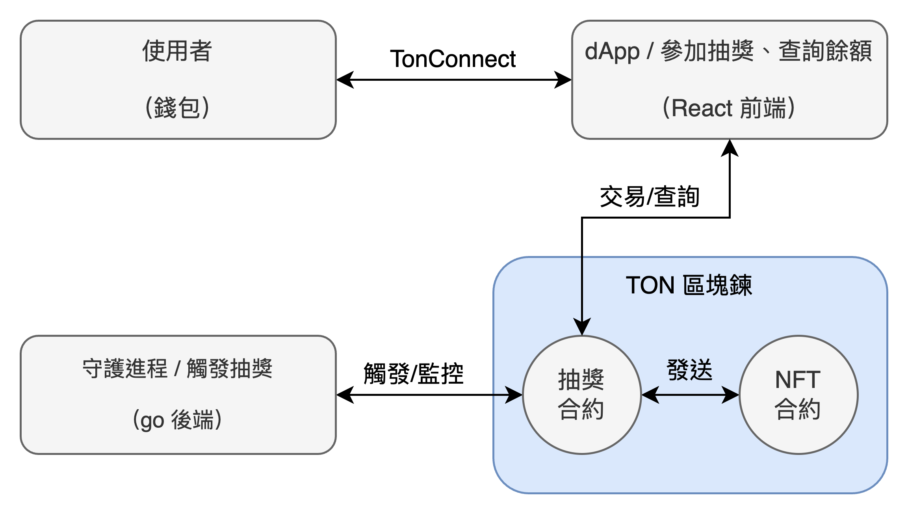
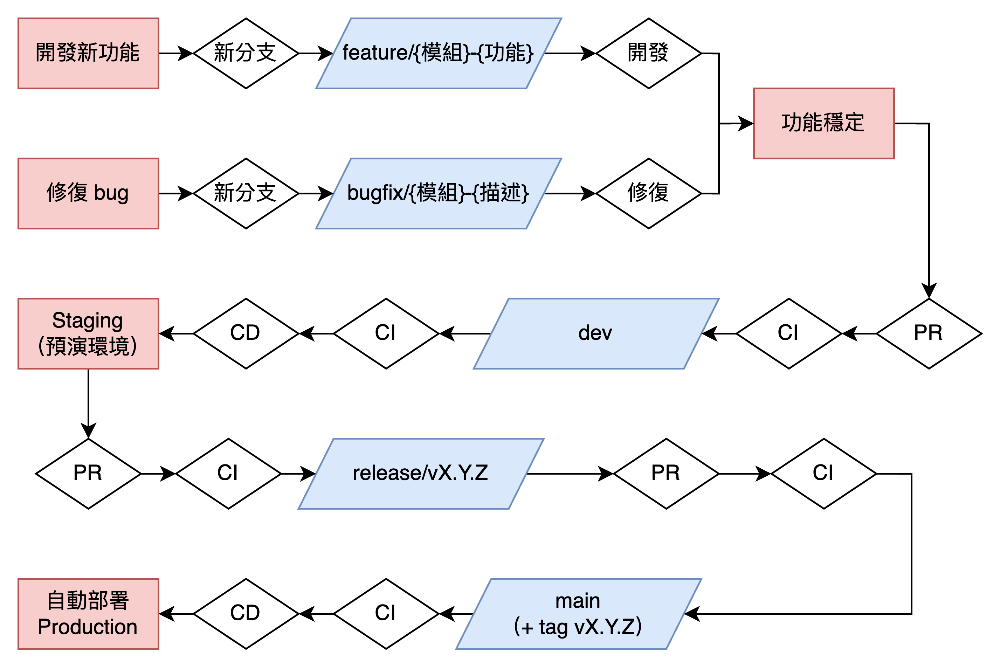
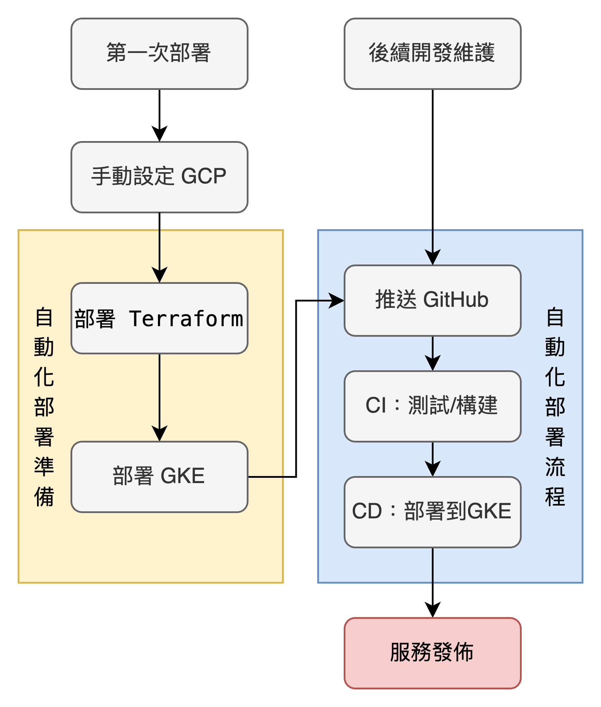

# TON Cat Lottery dApp — 貓咪 NFT 抽獎平台

> 一個基於 TON 區塊鏈的鏈上抽獎系統，參加者可支付少量 TON 參與抽獎，有機會贏得限量版貓咪 NFT。

> 前端使用 React + TonConnect，後端使用 Go 來實作自動抽獎機器人，整體部署採用容器（Docker）化，並透過 terraform 來自動編排 GCP 基礎設施部署和搭配 GitHub Action 完成 CI/CD。

---

## ✨ 專案亮點

- **全鏈上邏輯**：使用 Tact 撰寫智能合約，負責抽獎與 NFT 發送
- **後端自動化抽獎機器人**：Go 撰寫 RPC 調用邏輯，自動觸發中獎邏輯
- **前端與錢包互動**：React + TonConnect，與 TON 錢包整合參與抽獎
- **Docker 容器化**：後端、前端、節點、監控模組皆為獨立容器
- **微服務架構**：各個模組透過 k8s 來實作微服務化
- **完整 DevOps 管線**：Terraform、GitHub Actions CI/CD

---

## 📋 目錄

- [🖼️ 系統架構圖](#️-系統架構圖)
- [🛠️ 開發工具](#️-開發工具)
- [📦 專案目錄結構](#-專案目錄結構)
- [🧠 核心功能模組](#-核心功能模組)
  - [🎯 智能合約（CatLottery.tact）](#-智能合約catlotterytact)
  - [🧰 後端自動抽獎機器人（Go）](#-後端自動抽獎機器人go)
  - [⚙️ DevOps 架構細節](#️-devops-架構細節)
- [🚀 智能合約](#-智能合約)
- [📚 技術棧](#-技術棧)
- [🏁 TODO Checklist - 功能導向模組拆解](#-todo-checklist---功能導向模組拆解)

---
## 🖼️ 系統架構圖


---
## 🛠️ 開發工具
- 透過 ChatGPT 來瞭解 DevOps 所需的技術鍊
- 閱讀各個工具的文檔來瞭解詳細技術：
  - **區塊鍊**：https://www.geeksforgeeks.org/software-engineering/blockchain/
  - **Ton**：https://docs.ton.org/v3/documentation/ton-documentation
  - **Terraform**：https://developer.hashicorp.com/terraform/docs
  - **k8s**：https://kubernetes.io/docs/home/
  - **cert-manager**：https://cert-manager.io/docs/
  - **GitHub Action**：https://docs.github.com/en/actions/get-started/understand-github-actions
- 開發過程透過 **cursor** 和 **Claude Code** 來協助開發
---
- 開發流程：
  

---
- 部署流程：
  

### 環境需求
```
- Node.js >= 22.18.0
- Go >= 1.24.5
```

---

## 📦 專案目錄結構

```bash
ton-cat-lottery/
├── contracts/                # Tact 智能合約
│   ├── CatLottery.tact       # 主抽獎合約
│   ├── CatNFT.tact           # 貓咪 NFT 合約
│   ├── scripts/              # 部署與互動腳本
├── backend/                  # Go 抽獎機器人服務  
├── frontend/                 # React dApp
├── docker/                   # 前端/後端容器話設定
├── terraform/                # terraform 基礎設施部署設定
├── k8s/                      # 微服務設定
├── .github/workflows/        # CI/CD 配置
├── docker-compose.yml        # Docker 容器編排
└── README.md
```

---

## 🧠 核心功能模組

### 🎯 智能合約（CatLottery.tact）

[NFT 合約文檔](docs/ContractREADME.md)

[貓咪樂園抽獎故事](docs/NFTStory.md)


### 🧰 後端自動抽獎機器人（Go）

[後端架構文檔](docs/BackendREADME.md)


### ⚙️ DevOps 架構細節

[DevOps文檔](docs/DevOpsREADME.md)

---

## 🚀 智能合約

| 類別        | 合約地址                                            |
| ---------- | -------------------------------------------------- |
| CatLottery | `EQCryV3r0cEnqgvzyWq4yNxubV517muKMYSyoaAWDpOjW1o7` |
| CatNFT     | `EQAe1Lf-KV_IPAfOQ1JJBEZRJ6_5wqyvzW9a_o7kGmpUdsVJ` |

---


## 📚 技術棧

| 類別     | 技術                           |
| -------- | ------------------------------ |
| 程式語言 | Typescript, Go, Node.js, React |
| 區塊鏈   | TON, Tact, TonConnect          |
| 後端     | Go, Node.js                    |
| 前端     | React                          |
| 部署     | Docker, GitHub Actions, k8s    |
| 基礎設施 | Terraform, GCP                 |
| 監控觀測 | Prometheus, Grafana, Alertmanager |

---

## 🏁 TODO Checklist - 功能導向模組拆解

> 本清單依照功能模組拆解為可執行任務，便於開發與進度追蹤。

---
### 智能合約模組（Tact）

> 定義好「抽獎怎麼運作」「怎麼發 NFT」「參與者怎麼加入」。

#### 設計合約和 NFT 相關的邏輯
- [x] 抽獎合約如何定義
- [x] NFT 合約如何定義
- [x] 檢查兩者的邏輯和整合方案

#### 開發
##### 抽獎合約
- [x] 初始化 `CatLottery.tact` 合約結構（定義 join/drawWinner/sendNFT）
- [x] 設計儲存參加者資料的 Cell 結構（儲存地址列表）
- [x] 實作 `join()` 方法（收款 + 儲存參與者）
- [x] 實作 `drawWinner()` 方法（隨機選取中獎者，待整合自動發送 NFT）
- [x] 實作 `sendNFT()` 方法（內建 NFT 發送邏輯，需NFT合約支持）
- [x] 實作 `withdraw()` 方法（提取合約餘額，僅擁有者可調用）
- [x] 實作 `SetNFTContract` 消息處理（設定 NFT 合約地址）
- [x] 實作 `getCatNameByTemplate()` 輔助方法（根據模板 ID 獲取貓咪名稱）
- [x] 設計事件系統（ParticipantJoined, LotteryFull, WinnerDrawn, NFTSent，需完整整合測試）
- [x] 新增 NewRoundStarted 事件（提供更好的狀態監控）
- [x] 實作合約狀態管理（lotteryActive、participantCount、currentRound）
- [x] 實作 `startNewRound()` 方法（重置狀態並開始新輪次）
- [x] 實作合約自動重置機制（drawWinner 後自動清理狀態）
- [x] 實作查詢方法（getContractInfo, getParticipant, getWinner, getBalance）

##### NFT 合約
- [x] 撰寫 `CatNFT.tact` 合約（符合 TON NFT 規範）
- [x] 實作 `MintTo(address)` 方法（接收來自 CatLottery 的鑄造請求）
- [x] 實作 `SetAuthorizedMinter()` 方法（設定授權鑄造者）
- [x] 設計 4 種稀有度貓咪 NFT（Common, Rare, Epic, Legendary）
- [x] 實作 NFT metadata 和貓咪屬性系統  
- [x] 實作 `determineRarity()` 機率系統（Common 60%, Rare 25%, Epic 10%, Legendary 5%）
- [x] 實作 `initializeCatTemplates()` 方法（初始化 4 種貓咪模板）
- [x] 設定 NFT 合約與抽獎合約的授權機制
- [x] 實作查詢方法（getNFT, balanceOf, getCatTemplate, getContractInfo, getAllCatTemplates）
- [x] 實作 NFT 事件系統（NFTMinted）

##### 部署和測試腳本
- [x] 撰寫 `deployCatLottery.ts` 部署腳本（包含合約驗證和資訊記錄）
- [x] 撰寫 `deployCatNFT.ts` 部署腳本（包含貓咪模板驗證）
- [x] 撰寫 `integrationTest.ts` 整合測試腳本（完整抽獎流程自動化測試）
- [x] 撰寫 `testNFTContract.ts` NFT 合約邏輯驗證腳本

##### 配置文件
- [x] 更新 `tact.config.json` 支援雙合約編譯
- [x] 確保合約編譯配置正確（debug 模式、external 設定）

##### 文檔更新
- [x] 完整更新 `docs/ContractREADME.md` 
  - [x] 添加完整檔案結構和函數列表
  - [x] 更新項目概覽包含所有已實作功能
  - [x] 添加 NFT 稀有度系統詳細說明
  - [x] 添加技術特色（安全特性、高可用性、Gas 優化）
  - [x] 添加快速開始指南和部署資訊
  - [x] 添加故障排除指南

#### 測試

##### 單元測試
- [x] **CatLottery 合約單元測試 (40個測試案例)**
  - [x] **合約初始化測試 (1個測試)**
    - [x] 驗證初始化參數正確性 (owner, entryFee, maxParticipants, currentRound, lotteryActive, participantCount, nftContract)
  
  - [x] **`join()` 方法測試 (7個測試)**
    - [x] 正確費用參與成功
    - [x] 費用不足時拒絕參與
    - [x] 同一地址重複參與檢查
    - [x] 多個不同用戶參與
    - [x] 達到最大參與人數自動停用抽獎
    - [x] 抽獎非活躍狀態拒絕參與
    - [x] 參與者資料正確記錄與索引
  
  - [x] **`drawWinner()` 方法測試 (6個測試)**
    - [x] 僅擁有者可執行抽獎
    - [x] 非擁有者執行抽獎被拒絕
    - [x] 中獎者選擇和結果記錄
    - [x] 抽獎後狀態重置 (lotteryActive=false, participantCount=0, 清空參與者列表)
    - [x] 無參與者時抽獎失敗
    - [x] NFT ID 生成驗證 (currentRound * 1000 + random)
  
  - [x] **`sendNFT()` 方法測試 (4個測試)**
    - [x] 抽獎時成功發送 NFT 到 NFT 合約
    - [x] NFT 合約未設定時失敗
    - [x] 充足 Gas 費用的 NFT 鑄造
    - [x] Gas 不足時優雅處理
  
  - [x] **`SetNFTContract` 訊息測試 (3個測試)**
    - [x] 擁有者設定 NFT 合約地址成功
    - [x] 非擁有者設定 NFT 合約地址被拒絕
    - [x] 擁有者更新 NFT 合約地址
  
  - [x] **`startNewRound()` 方法測試 (5個測試)**
    - [x] 擁有者在抽獎非活躍時開始新輪次
    - [x] 非擁有者開始新輪次被拒絕
    - [x] 抽獎活躍時開始新輪次被拒絕
    - [x] 開始新輪次時清空參與者列表
    - [x] 新輪次可接受新參與者
  
  - [x] **`withdraw()` 方法測試 (5個測試)**
    - [x] 擁有者在抽獎非活躍時提取餘額
    - [x] 非擁有者提取餘額被拒絕
    - [x] 抽獎活躍時提取餘額被拒絕
    - [x] 提取後保持最小合約餘額 (0.1 TON)
    - [x] 合約餘額不足時處理
  
  - [x] **查詢函數測試 (7個測試)**
    - [x] `getBalance()` - 合約餘額查詢
    - [x] `getParticipant()` - 參與者資訊查詢 (存在/不存在/邊界值)
    - [x] `getWinner()` - 中獎記錄查詢 (存在/不存在/多輪次)
    - [x] `getContractInfo()` - 合約狀態一致性驗證
    - [x] 多輪次中獎記錄正確性
    - [x] 零參與者邊界情況
    - [x] 邊界值索引處理
  
  - [x] **輔助功能測試 (3個測試)**
    - [x] `getCatNameByTemplate()` - 不同模板 ID 的貓咪名稱 (間接測試)
    - [x] 合約初始化參數驗證
    - [x] 隨機數生成邊界情況處理

- [x] **CatNFT 合約單元測試 (19個測試案例)**
  - [x] **合約初始化測試 (4個測試)**
    - [x] 驗證初始化參數正確性 (owner, authorizedMinter, nextTokenId, totalSupply)
    - [x] 4種貓咪模板初始化驗證 (Common, Rare, Epic, Legendary)
    - [x] 不存在模板的null返回處理
    - [x] 所有模板屬性完整性驗證 (name, rarity, description, attributes, image)
  
  - [x] **`SetAuthorizedMinter` 訊息測試 (3個測試)**
    - [x] 擁有者設定授權鑄造者成功
    - [x] 非擁有者設定授權鑄造者被拒絕
    - [x] 擁有者更新授權鑄造者地址
  
  - [x] **`MintTo()` 方法測試 (6個測試)**
    - [x] 授權鑄造者成功鑄造 NFT
    - [x] 無授權鑄造者時拒絕鑄造 (需修復合約邏輯)
    - [x] 未授權地址鑄造 NFT 被拒絕
    - [x] 多個 NFT 遞增狀態管理
    - [x] 同一擁有者多個 NFT 餘額更新
    - [x] 鑄造通知發送給接收者
  
  - [x] **查詢函數測試 (4個測試)**
    - [x] `balanceOf()` - 地址 NFT 餘額查詢 (零餘額/有餘額)
    - [x] `getContractInfo()` - 合約狀態資訊 (鑄造前後狀態對比)
    - [x] `getCatTemplate()` - 貓咪模板查詢 (所有模板驗證)
    - [x] 多地址餘額查詢處理
  
  - [x] **邊界情況和錯誤處理 (3個測試)**
    - [x] 不同擁有者的合約初始化
    - [x] 失敗操作後狀態一致性維護
    - [x] Gas 費用不足時的適當處理
  
  
  - [x] **`determineRarity()` 稀有度系統** (間接通過模板測試驗證)
    - [x] 4種稀有度模板正確映射 (Common 60%, Rare 25%, Epic 10%, Legendary 5%)
    - [x] 模板一致性驗證 (templateId 與 rarity 對應)

##### 整合測試 ✅
- [x] **端到端流程測試**
  - [x] 完整抽獎流程 (join → drawWinner → NFT自動發送)
  - [x] 合約間授權配置 (SetNFTContract + SetAuthorizedMinter)
  - [x] 多輪次抽獎連續性測試

##### 進階測試 ✅
- [x] **安全性驗證**
  - [x] 權限控制完整性檢查
  - [x] Gas費用優化驗證
  - [x] 重入攻擊防護測試

- [x] **效能與穩定性**
  - [x] 稀有度分佈統計驗證 (透過模板驗證)
  - [x] 系統負載壓力測試
  - [x] 長期運行穩定性驗證 (多輪次循環測試)

**📝 註：** 上述大部分功能已在單元測試中覆蓋，整合測試主要針對合約間互動和生產環境驗證。


#### 部署
- [x] 部署抽獎合約到 TON testnet
- [x] 部署 NFT 合約到 TON testnet
- [x] 設定合約間整合（CatLottery 指向 CatNFT 地址）
- [x] 基礎部署後驗證
  - [x] 合約地址記錄和備份（已記錄在 docs/ContractREADME.md）
  - [x] 合約功能驗證測試（完整抽獎流程）
  - [x] 更新環境配置檔案（deployments/ 目錄自動生成部署資訊）


---
### 後端服務模組（Go）

> 基於 Go 的智能抽獎守護進程，專注於自動化監聽和管理 TON 區塊鏈上的貓咪 NFT 抽獎系統。後端只做一件事：監聽 `lotteryActive` 狀態變化，自動觸發 `drawWinner`，依賴合約處理所有業務邏輯。

**🏗️ 技術架構**: Go 1.19+、TON API 客戶端、HTTP 輪詢、無狀態守護進程、內存緩存 + 合約狀態同步

**🎯 推薦實作順序：基礎設置 → 合約客戶端 → 核心監聽 → 保障機制 → 測試部署**

#### 設計模組
- [ ] 簡化守護進程設計（狀態監聽 + 交易觸發 `drawWinner`）
- [ ] 最小化干預原則（依賴合約自動化流程）
- [ ] 保障機制設計（重試、監控、恢復機制）

#### 撰寫邏輯代碼
- TON API 的實作可以參考: `contracts/scripts/setupContracts.ts`

- [ ] 項目基礎設置
  - [ ] 建立 `go.mod` 和基本目錄結構 (`internal/`, `cmd/`, `pkg/`)
  - [ ] 配置 `tonutils-go` SDK 依賴 (github.com/xssnick/tonutils-go)
  - [ ] 設置環境配置文件 `.env` 模板和讀取邏輯
  - [ ] 實現基本日誌系統和錯誤處理

- [ ] TON 客戶端和合約接口
  - [ ] 實現 TON testnet 連接客戶端 (使用 tonutils-go)
  - [ ] 創建 CatLottery 合約接口和狀態查詢功能
  - [ ] 實現合約狀態緩存機制 (避免頻繁 API 調用)
  - [ ] 添加合約調用重試和錯誤處理機制

- [ ] 核心監聽 `lotteryActive` 邏輯
  - [ ] 實現定時器 (可配置間隔，建議 30-60 秒)
  - [ ] 合約狀態輪詢邏輯 (`getContractInfo()` 調用)
  - [ ] 狀態變化檢測 (從 `true` 到 `false` 的轉換)
  - [ ] 參與者數量驗證 (確保 >= 3 人才觸發)

- [ ] 錢包私鑰管理
  - [ ] 實現 W5 錢包創建 (從 24 字助記詞)
  - [ ] 安全的私鑰存儲和讀取 (從環境變數)
  - [ ] 錢包餘額檢查和充足性驗證
  - [ ] 交易簽名和發送封裝函數

- [ ] 自動觸發 `drawWinner`
  - [ ] 實現 `drawWinner` 交易構建邏輯
  - [ ] 交易參數配置 (動態計算 gas 費用)
  - [ ] 使用私鑰自動簽署和發送交易
  - [ ] 交易狀態追蹤和確認機制

- [ ] 保障機制
  - [ ] 交易失敗重試機制 (最多 3 次，指數退避)
  - [ ] 網路連接異常處理和自動重連
  - [ ] 錢包餘額不足警告和暫停機制
  - [ ] 狀態不一致檢測和恢復邏輯
  - [ ] 系統健康檢查和監控指標


#### 測試
- [ ] 單元測試
  - [ ] TON 客戶端連接和配置測試
  - [ ] 錢包創建和私鑰管理測試
  - [ ] 合約狀態查詢和緩存邏輯測試
  - [ ] 狀態變化檢測邏輯測試
  - [ ] 交易構建和簽名測試 (Mock 模式)

- [ ] 集成測試
  - [ ] 與 testnet 合約的完整交互測試
  - [ ] 實際 `drawWinner` 交易發送和確認測試
  - [ ] 錯誤情況下的重試和恢復測試
  - [ ] 長時間運行的穩定性測試

- [ ] 異常情況測試
  - [ ] 網路中斷和重連測試
  - [ ] 合約狀態異常處理測試
  - [ ] 錢包餘額不足場景測試
  - [ ] 交易失敗和重試邏輯測試
  - [ ] API 限速和背壓處理測試

#### 部署
- [ ] 容器化配置
  - [ ] 完善 `Dockerfile.backend` (multi-stage build)
  - [ ] 創建 `.env.example` 環境變數模板
  - [ ] 更新 `docker-compose.yml` 後端服務配置
  - [ ] 配置健康檢查和重啟策略

- [ ] 生產部署準備
  - [ ] 實現 graceful shutdown 機制
  - [ ] 添加性能監控和日誌輸出
  - [ ] 配置資源限制和安全設置
  - [ ] 準備 Kubernetes 部署文件 (如果需要)

#### 文檔和維護
- [ ] 技術文檔
  - [ ] 更新 `docs/BackendREADME.md` 詳細說明
  - [ ] 添加架構圖和流程圖
  - [ ] 創建故障排除指南
  - [ ] 編寫 API 和配置參考文檔

- [ ] 運維文檔
  - [ ] 部署和配置指南
  - [ ] 監控和告警設置說明
  - [ ] 常見問題和解決方案
  - [ ] 安全性檢查清單

---
### 前端 dApp（React + TonConnect）

> 在智能合約初步穩定後，你可以建立 dApp 前端與錢包互動。

#### 設計客戶端界面和模組架構
- [x] 設計界面
- [x] 定義需要哪些 components

#### 開發
##### 基本功能

- [x] 建立 React 專案架構 (Vite + TypeScript + 基礎 CSS)
- [x] 整合 TonConnect SDK - 支援 Tonkeeper 錢包連接與斷開
- [x] 建立自己的 mainfest 用來做測試，透過 cloudflare pages 來部署
- [x] 顯示合約狀態 - 參與人數、當前輪次、抽獎是否活躍
  - [x] 使用模擬資料來顯示合約狀態
  - [x] 串接真實的合約資料
- [x] 實作參加抽獎功能 - 發送 `join()` 交易並支付參與費用
  - [x] 合約還沒部署完成，所以先使用空 payload 來測試
  - [x] 合約部署完成後，使用 "join" 消息
- [x] 顯示用戶錢包資訊 - 地址、TON 餘額
- [x] 基礎交易狀態提示 - 發送中、成功、失敗通知
- [x] 基礎錯誤處理 - 網路錯誤、餘額不足、抽獎已滿等
- [x] 參與者列表顯示 - 當前輪次的參與者地址
- [x] 顯示中獎歷史記錄 - 查詢歷史輪次的中獎者和 NFT

##### 進階功能

- [ ] 實作即時狀態更新 - 定期刷新合約狀態（每 30 秒）
- [ ] 顯示獎池資訊 - 當前合約餘額和預計獎金
- [ ] 基礎響應式設計 - 支援手機和桌面瀏覽

#### 測試
- [x] 基礎測試
  - [x] ESLint 和 TypeScript 檢查
  - [x] 產品建構測試 (npm run build)

- [x] 整合測試
  - [x] 與 testnet 合約的整合測試
  - [x] 端到端 (E2E) 測試 (錢包連接 → 參與抽獎流程)

- [x] 容器化與測試
  - [x] 完善 `../docker/Dockerfile.frontend`
  - [x] 完善 `.dockerignore`
  - [x] 測試 Dockerfile
  - [x] 完善 docker-compose.yml

- [ ] 建構測試
  - [ ] 不同環境建構驗證 (staging/production)
    - `dev` branch for staging env
    - `main` branch for production env
  - [ ] 更新 ci.yml 和 cd.yml

---
### DevOps / 雲端自動化部署

> 階段式 DevOps 實作流程：容器化 → 雲端基礎設施 → Kubernetes 部署 → CI/CD 自動化 → 基礎監控

> 採用雙環境架構：Production + Staging，單一靜態 IP 智能路由

| 階段 | 內容                    | 技術棧                     | 核心目標       |
| ---- | ----------------------- | -------------------------- | -------------- |
|  1   | 基礎容器化              | Docker + Docker Compose | 建立完整容器化開發環境 |
|  2   | GCP 雲端設定            | GCP Console + Artifact Registry | 完成雲端帳號和容器映像庫設定 |
|  3   | 模塊化基礎設施           | Terraform + GKE Autopilot + Secret Manager | 建立單一 Terraform 雙環境基礎架構 |
|  4   | Kubernetes 應用部署     | Kustomize + Ingress + 守護進程配置 | 實現雙環境應用層部署 |
|  5   | CI/CD 自動化流程        | GitHub Actions + OIDC + 雙環境管理 | 建立完整自動化部署流水線 |
|  6   | Prometheus + Grafana 監控體系 | Prometheus + Grafana + AlertManager | 建立完整監控可視化體系 |


---
#### 階段 1：基礎容器化

> 技術：Docker + Docker Compose

**目標：建立完整的容器化開發環境**

- [x] **1. 撰寫 Dockerfile：**
  - [x] 撰寫 `Dockerfile.backend`
  - [x] 撰寫 `Dockerfile.frontend`
  - [x] 撰寫 `docker-compose.yml` 整合後端 / 前端
  - [x] 撰寫 `.env` 檔案與 secret 管理

- [x] **2. 測試 Dockerfile**
  - [x] 本地 Docker 環境驗證與測試
  - [x] 驗證部署：`docker-compose up --build`

- [x] **3. 映像優化與安全配置：**
  - [x] 多階段建構優化：減少最終映像大小
  - [x] 非 root 用戶配置：增強容器安全性
  - [x] 健康檢查配置：實現容器自我監測
  - [x] .dockerignore 優化：排除不必要檔案，加速建構

- [x] **4. 容器驗證和優化：**
  - [x] 本地容器測試（docker-compose ps 狀態檢查）
  - [x] 容器安全和效能檢查（docker scan、docker stats、安全配置驗證）
  - [x] 環境變數配置驗證（前後端環境變數正確載入）

- [x] **5. 內容整理：**
  - [x] 重新驗證這個階段的 todos
  - [x] 更新主目錄`.gitignore` for docker
  - [x] 整理內容到 `docs/DevOpsREADME.md`

---
#### 階段 2：GCP 雲端設定

> 技術：GCP Console + Artifact Registry + 開發工具配置

**目標：建立 GCP 專案基礎，配置容器映像庫和開發工具鏈**

- [x] **1. GCP 帳號與計費設定**
  - [x] 註冊 GCP 帳號並建立專案 `ton-cat-lottery-dev-3`
  - [x] 設定計費帳戶與預算告警（$70/月開發限制）
  - [x] 預算管理優化：多層級告警、環境別預算分配、成本優化策略

- [x] **2. 本地開發工具安裝：**
  - [x] 安裝 Google Cloud SDK、Terraform、kubectl
  - [x] 設定認證和專案配置

- [x] **3. Terraform 服務帳戶設定：**
  - [x] 建立 Terraform 服務帳戶
  - [x] 分配必要權限（Project Editor、Kubernetes Engine Admin、Service Account Admin）
  - [x] 下載服務帳戶金鑰 JSON 檔案並設定安全權限
  - [x] 安全性最佳實踐優化

- [x] **4. Artifact Registry 容器映像庫設定：**
  - [x] 建立 Artifact Registry Repository (`tcl-repo`, location: `asia-east1`)
  - [x] 配置 Docker 認證 (`gcloud auth configure-docker asia-east1-docker.pkg.dev`)
  - [x] 測試映像推送流程 (`hello-world` 映像測試)
  - [x] 驗證 Registry 運作並清理測試映像

- [x] **5. 內容整理：**
  - [x] 重新驗證這個階段的 todos
  - [x] 更新主目錄 `.gitignore` for GCP
  - [x] 整理內容到 `DevOpsREADME.md`

---
#### 階段 3：Terraform 基礎設施設置

> 技術：Terraform Modules + GKE Autopilot + cert-manager + Cloudflare DNS + Secret Manager

**目標：建立模塊化雲端基礎設施，實現單一 Terraform 管理雙環境架構**

- 文檔參考: `docs/DevOpsREADME.md` ## Terraform

- [x] **1. Terraform 模塊化架構設計：**
  - [x] 建立單一配置目錄結構
  - [x] GCP API 啟用清單（7個核心API）
  - [x] 核心資源精簡清單（單一靜態IP + 雙域名配置）

- [x] **2. 模塊化配置檔案建立：**
  - [x] 核心模組開發（networking、gke、dns、ssl、namespaces、secrets、iam、monitoring）
  - [x] 環境配置整合（main.tf、variables.tf、outputs.tf、providers.tf）
  - [x] State 管理和安全（backend.tf、GCS Bucket、Terraform 服務帳戶權限）
  - [x] Monitoring 基礎設施準備（namespace、storage、RBAC 權限、DNS 子域名）

- [x] **3. 智能部署和驗證流程：**
  - [x] 模塊化部署策略（階段式部署：networking → gke → kubectl配置 → k8s資源）
  - [x] 依賴關係修正（kubernetes provider 在集群就緒後才執行）
  - [x] 基礎設施驗證（GKE集群健康、靜態IP、VPC、cert-manager）
  - [x] DNS 和 SSL 一鍵驗證（解析檢查、證書狀態、HTTPS連接測試）
  - [x] 雙環境完整驗證（Namespace + ResourceQuota、Secret Manager、網路安全）
  - [x] Monitoring 基礎設施驗證（namespace、storage、RBAC 權限）


- [x] **4. 單一配置管理和成本優化：**
  - [x] 統一管理和安全配置（Terraform 狀態管理、Secret 安全性、RBAC 權限檢查、資源標籤策略）
  - [x] 成本優化和監控（資源使用監控、GCP 成本監控、資源標籤檢查、測試環境節省）

- [x] **5. 內容整理：**
  - [x] 重新驗證這個階段的 todos
  - [x] 更新主目錄 `.gitignore` - terraform 計劃檔案和敏感內容
  - [x] 整理內容到 `DevOpsREADME.md`

---
#### 階段 4：Kubernetes 應用部署

> 技術：Kustomize + Docker Images + Ingress 路由 + 守護進程配置

**目標：實現雙環境應用層部署，專門優化後端守護進程配置**

- [x] **1. 環境準備和驗證：**
  - [x] 檢查 Terraform 階段式部署（networking → gke → kubectl配置 → k8s資源）
  - [x] 基礎設施確認（GKE集群健康、靜態IP、Artifact Registry、SSL證書、DNS）
  - [x] 權限配置修復（GKE 節點訪問 Artifact Registry 權限）
  - [x] 基礎工具準備（Docker + GCP 設置、雙環境 namespace 確認）

- [x] **2. 精簡 Docker 映像策略：**
  - [x] 統一映像標籤策略（只使用 commit hash，不使用 latest 標籤）
  - [x] 精簡映像建構（Backend 映像、Frontend 映像、映像驗證）
  - [x] 映像基礎優化（多階段建構、基礎安全）

- [x] **3. 建立 K8s 雙環境部署檔案：**
  - [x] 組織 `k8s/` 目錄結構（base、overlays/production、overlays/staging、ingress）
  - [x] 共用基礎配置（frontend deployment + service、backend deployment + configmap）
  - [x] 後端守護進程配置（**無對外 Service**、HTTP 健康檢查 `/health:8080`、TON 合約監聽配置）
  - [x] Kustomize 雙環境配置（Production 和 Staging 環境 overlay、replica 和 resource patches）
  - [x] 單一 Ingress 雙域名配置（cat-lottery.chaowei-liu.com + dev.cat-lottery.chaowei-liu.com）
  - [x] ConfigMap + K8s Secrets 配置管理

- [x] **4. 應用安全和生產配置：**
  - [x] 基礎安全配置（Pod Security Context、Resource Limits、Service Account）
  - [x] 基本生產功能（前後端差異化健康檢查、結構化日誌配置、環境標籤）
  - [x] 映像拉取問題解決方案（權限配置 + patch deployment 修復）

- [x] **5. 雙環境部署和驗證：**
  - [x] 部署前檢查（GKE集群狀態、Namespaces、SSL證書）
  - [x] 雙環境一鍵部署（Production、Staging、統一 Ingress）
  - [x] 部署狀態驗證（應用狀態檢查、服務連通性測試）
  - [x] 雙環境完整驗證（健康檢查測試、後端守護進程驗證、SSL 證書狀態）

- [x] **6. 內容整理：**
  - [x] 重新驗證這個階段的 todos
  - [x] 更新主目錄 `.gitignore` for k8s (k8s/ 目錄已建立)
  - [x] 整理內容到 `DevOpsREADME.md` (完整的快速啟動指南已建立)

---

#### 階段 5：CI/CD 自動化流程

> 技術：GitHub Actions + GCP OIDC + Workload Identity + 自動化部署

**目標：建立完整的 CI/CD 流水線，實現安全的無金鑰部署**

- [ ] **1. 基礎 CI/CD 準備：**
  - [ ] GitHub 儲存庫設定（`.github/workflows/` 目錄、分支保護）
  - [ ] GCP OIDC 設定（執行 `setup-gcp-oidc.sh` 建立 `github-pool` 和 `gha-deploy` 服務帳戶）
  - [ ] GitHub Secrets 配置（`GCP_WIF_PROVIDER`、`GCP_SERVICE_ACCOUNT`、`PROJECT_ID`）
  - [ ] 驗證 OIDC 設定（`gcloud iam workload-identity-pools list`）

- [ ] **2. 品質關卡 CI Pipeline：**
  - [ ] 三層品質驗證（代碼品質、安全掃描、Docker 驗證）
  - [ ] 品質閾值和失敗處理

- [ ] **3. Production 部署流程：**
  - [ ] 安全措施和映像建構
  - [ ] 滾動更新和部署驗證

- [ ] **4. 智能環境清理：**
  - [ ] 多種清理觸發機制（PR關閉、定時清理、手動清理）
  - [ ] 安全措施和日誌記錄

- [ ] **5. 錯誤處理和回滾機制：**
  - [ ] 自動回滾策略
  - [ ] 通知和監控系統

- [ ] **6. 測試和監控：**
  - [ ] Pipeline 測試策略
  - [ ] 效能和成本監控

- [ ] **7. 內容整理：**
  - [ ] 重新驗證這個階段的 todos
  - [ ] 更新主目錄 `.gitignore` for CI/CD
  - [ ] 整理內容到 `DevOpsREADME.md`

---
#### 階段 6：Monitoring (Prometheus + Grafana)

> 技術：Prometheus + Grafana + AlertManager

**目標：建立完整的監控可視化體系，展示 DevOps 監控技能**

- [ ] **1. 監控基礎設施更新（Terraform）：**
  - [ ] 更新 Terraform monitoring 模組配置
  - [ ] 部署 monitoring namespace 和存儲資源
  - [ ] 配置 RBAC 權限和 DNS 記錄
  - [ ] 驗證基礎設施就緒

- [ ] **2. Prometheus 部署和配置：**
  - [ ] 部署 Prometheus Server 到 K8s 集群
  - [ ] 配置 kube-state-metrics 和 node-exporter
  - [ ] 實現應用 `/metrics` 端點暴露

- [ ] **3. Grafana Dashboard 建立：**
  - [ ] 部署 Grafana 並配置 Prometheus 數據源
  - [ ] 建立系統 Dashboard（CPU、Memory、Pod 狀態）
  - [ ] 建立應用 Dashboard（前後端服務監控）
  - [ ] 建立 TON 業務 Dashboard（抽獎狀態、交易監控）

- [ ] **4. AlertManager 告警配置：**
  - [ ] 部署 AlertManager 並設定告警規則
  - [ ] 配置關鍵指標告警（服務下線、資源異常）
  - [ ] 實現郵件通知機制

- [ ] **5. 監控驗證和調優：**
  - [ ] 驗證指標採集和 Dashboard 顯示
  - [ ] 測試告警觸發和通知功能
  - [ ] 優化告警規則和閾值設定

- [ ] **6. 內容整理：**
  - [ ] 重新驗證這個階段的 todos
  - [ ] 更新主目錄 `.gitignore` for monitoring
  - [ ] 整理內容到 `DevOpsREADME.md`

### 整理 Documentations
- [ ] 整理 Contracts 的 `README.md`
- [ ] 整理 Backend 的 `README.md`
- [ ] 整理 Frontend 的 `README.md`
- [ ] 整理 DevOps 的 `README.md`
- [ ] 整理 主目錄的 `README.md`